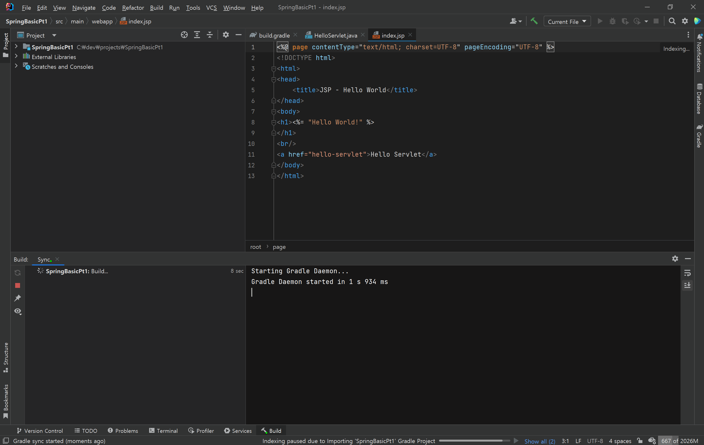
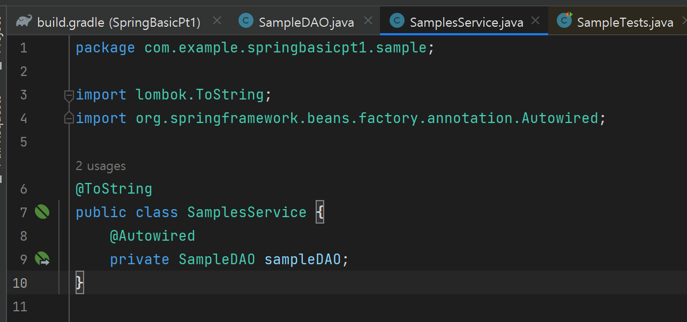
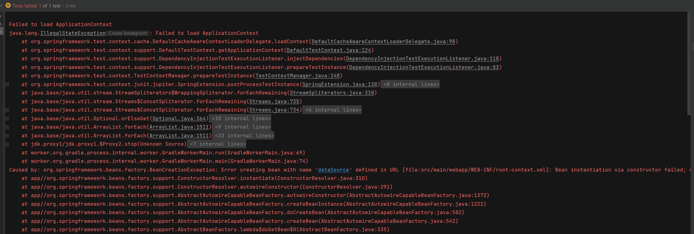

Intellij로 작업


`2022.2.5` 버전으로 작업.

2023 이후버전부터는 스프링 설정 파일 생성방법이 변경되어서 2023으로 작업을 원하는 경우 아래의 환경설정과 차이가 날 수 있음.


## 1. 프로젝트 생성
세팅 정보

- Template : `Web application`
- Application server : `Tomcat 9.0.87`
- Language : `Java`
- Build system : `Gradle`
- JDK : `JDK 17.0.11` (스프링 부트3대비 최소 JDK17로 작업)
 
프로젝트이름, Group 는 원하는대로 설정


Version : `Java EE 8` 로 변경 후 아무것도 체크하지 않고 `Create`

### 톰캣 설치
9버전대 기준

- Tomcat : [다운로드 링크](https://tomcat.apache.org/download-90.cgi)


Core 에서 zip 형식으로 다운


프로젝트에 넣기보단 따로 압축풀어 저장해놓자. 다른 곳에서도 쓸 일이 있을 수 있으니


`New` 버튼을 누르고 Tomcat Server 클릭 


경로를 잡아주면 된다. 본문 이미지에선
9.0.87 과 88이 수시로 변경될수 있다. 87로 작업해놓고 새 프로젝트는 88로 연습하고 자료 보충을 하면서 그렇다.


새 프로젝트가  생성 되면 인덱싱과 필요한 패키지를 다운로드 하고 있으므로 기다리자.



완료되었으면 Tomcat으로 잡고 실행


그러면 브라우저가 실행된다.

`http://localhost:8080/Gradle___com_example___SpringBasicPt1_1_0_SNAPSHOT_war/`


`http://localhost:8080/Gradle___com_example___SpringBasicPt1_1_0_SNAPSHOT_war/hello-servlet`


톰캣 설정


`Deployment` 카테고리에 미리 생성되어 있는 Deploy 삭제 후 추가


2번째 exploded 가 붙은것을 선택 


추가하고 `Application context` 부분을 `/` 만 남기고 제거


다시 실행해서 Hello World! 가 잘 되는지 확인


Services 에서도 별 문제가 안보이니 이제 스프링 라이브러리를 추가해야한다.

---

### 3. 스프링 라이브러리 추가

#### 1. `Spring Core` 라이브러리 추가
- https://mvnrepository.com/artifact/org.springframework/spring-core
- 

Spring Core 라는 라이브러리를 찾고 `5.3.30` 버전으로 한다.

`Gradle (Short)` 를 눌러 복사해주면 된다.


여러가지 라이브러리를 추가할 때는 같은 버젼을 이용하도록 주의.

라이브러리 버전에 다른 경우에는 제대로 동작하지 않을 수 있음.

프로젝트에 생성된 `build.gradle` 파일을 조정.

스프링과 관련해서 core, context, test 라이브러리를 우선적으로 추가.


패키지에 `build.gradle` 파일을 열고 
```gradle
dependencies {
    compileOnly('javax.servlet:javax.servlet-api:4.0.1')

    testImplementation("org.junit.jupiter:junit-jupiter-api:${junitVersion}")
    testRuntimeOnly("org.junit.jupiter:junit-jupiter-engine:${junitVersion}")
}
```
부분에 추가한다.


context,test도 스프링관련해서 필요한데 버전은 core와 따라가고 바뀌는 부분이 core 부분 이름만 달라지므로 한줄복사해서 수정했다.

#### 2. `Lombok` 라이브러리 추가

테스트 환경에서도 사용할 수 있도록 테스트 관련 설정도 한번에 추가.


버전 : `1.8.22`


#### 3. `Log4j2` 라이브러리 추가

버전 : `2.17.2`


resocrces 폴더에 log4j2.xml 추가


```xml
<?xml version="1.0" encoding="UTF-8"?>
<configuration status="WARN">
    <!-- 로그 설정의 전반적인 상태를 WARN 로 설정하여 정보 레벨의 로그 이상만 출력하도록 설정 -->
    <Appenders>
        <!-- Appenders 섹션: 로그를 출력할 대상을 정의 -->
        <Console name="console" target="SYSTEM_OUT">
            <!-- 콘솔 Appender: 로그 메시지를 시스템 콘솔(표준 출력)로 보냄 -->
            <PatternLayout pattern="%d{HH:mm:ss:SSS} [%t] %-5level %logger{36} -%msg%n"/>
            <!-- 로그 메시지의 출력 형식을 지정합니다. 시간, 우선순위, 카테고리, 메시지 순으로 표시됩니다.
                 charset="UTF-8"로 설정하여 로그의 문자 인코딩을 UTF-8로 지정합니다. -->
        </Console>
    </Appenders>
    <loggers>
        <!-- Loggers 섹션: 개별 로거의 동작을 설정합니다. -->
        <root level="INFO">
            <!-- Root 로거 설정: 기본 로그 레벨을 INFO 로 설정하고, 상위 로거로의 로그 전달을 차단 -->
            <AppenderRef ref="console"/>
            <!-- Root 로거의 로그를 console Appender 로 보냄 -->
        </root>
    </loggers>
</configuration>
```
작성하고 우상단에 돌고래 채인지 버튼 클릭


#### 4. `JSTL` 라이브러리 추가
2번째 것을 선택

버전은 `1.2`


현재까지 dependencies에 추가된 라이브러리
```gradle
dependencies {
    compileOnly('javax.servlet:javax.servlet-api:4.0.1')

    testImplementation("org.junit.jupiter:junit-jupiter-api:${junitVersion}")
    testRuntimeOnly("org.junit.jupiter:junit-jupiter-engine:${junitVersion}")

    // 1. Spring-core, spring-context, spring-test  추가
    // https://mvnrepository.com/artifact/org.springframework/spring-core
    implementation 'org.springframework:spring-core:5.3.30'
    implementation 'org.springframework:spring-context:5.3.30'
    implementation 'org.springframework:spring-test:5.3.30'

    // 2. Lombok 라이브러리 추가
    // https://mvnrepository.com/artifact/org.projectlombok/lombok
    compileOnly 'org.projectlombok:lombok:1.18.22'
    annotationProcessor 'org.projectlombok:lombok:1.18.22'
    testCompileOnly 'org.projectlombok:lombok:1.18.22'
    testAnnotationProcessor 'org.projectlombok:lombok:1.18.22'

    // 3. log4j2 라이브러리 추가
    // https://mvnrepository.com/artifact/org.apache.logging.log4j/log4j-core
    implementation 'org.apache.logging.log4j:log4j-core:2.17.2'
    implementation 'org.apache.logging.log4j:log4j-api:2.17.2'
    implementation 'org.apache.logging.log4j:log4j-slf4j-impl:2.17.2'

    // 4. jstl 라이브러리 추가
    // https://mvnrepository.com/artifact/javax.servlet/jstl
    implementation 'javax.servlet:jstl:1.2'
}
```

---

### 4. 의존성 주입하기

sample 패키지 생성하고, `SampleService`와 `SampleDAO` 클래스 추가

#### 1) 설정 파일추가

스프링 프레임워크는 자체적으로 객체를 생성하고 관리하면서 필요한 곳으로 객체를 주입 inject하는 역할을 하는데

이를 위해서는 `설정 파일`이나 `어노테이션` 등을 이용.

스프링이 관리하는 객체들은 빈 `Bean`이라는 이름으로 불리는데
프로젝트 내에서 **어떤 빈(객체)들을 관리하는 것인지를 설정**하는 설정 파일을 작성할 수 있음.

스프링의 빈 설정은 **XML을 이용**하거나, 별도의 **클래스를 이용**하는 자바 설정이 가능.

여기서는 `XML` 설정을 이용.

WEB-INF 선택 후 마우스 오른쪽 버튼 클릭 후 NEW -> XML Configuration File -> Spring Config
- 파일이름은 `root-context.xml`


> Spring config가 안뜨는 경우
>
> log4j2.xml 추가 하는 과정에서 반영이 제대로 안되었을 가능성이 있음. 거기서 부터 다시 따라오기


생성된 파일을 열면 오른쪽 상단에 `Configure application context` 클릭.


하는 이유
- 현재 프로젝트를 인텔리제이에서 스프링 프레임워크로 인식하고 필요한 기능들을 지원하기 위한 설정.

설정 코드 작성
<bean> 태그를 이용하여 SampleService와 SampleDAO를 설정.


아래 탭에서 설정된 객체를 아이콘으로 확인.

### 2) 스프링의 빈 설정 테스트

* 테스트 패키지 자동 생성 방법
1) 코드 에디터에서 마우스 오른쪽 버튼 클릭. Go To -> Test 선택


`Create New Test...` 클릭


Class name을 `SampleTests` 로 변경 후 OK 클릭


SampleTests.java 라는 테스트 클래스가 생성되고 위치도 test 폴더 경로에 생성됨을 확인


이렇게 하는 이유
- 스프링으로 프로젝트를 구성하는 경우 상당히 많은 객체를 설정하기 때문에
나중에 한 번의 에러가 발생했을 때 원인을 찾으려고 하면 상당히 어려운 경우가 많음.
-  따라서 가능하다면 개발 단계에서 많은 테스트를 진행하면서 개발하는 것이 좋음.

 test 폴더에 프로젝트와 동일하게 패키지 생성을 하고 SampleTests 클래스를 추가.

```java
package com.example.springbasicpt1.sample;

import static org.junit.jupiter.api.Assertions.*;

class SampleTests {

}
```


#### SampleTest
- SampleService를 멤버 변수로 선언하고 `@Autowired`라는 어노테이션을 적용.
- `@Autowired`는 스프링에서 사용하는 의존성 주입 관련 어노테이션으로
'만일 해당 타입의 빈 Bean이 존재하면 여기에 주입해 주기를 원한다'하는 의미.
- 
@ExtendWith(SpringExtension.class)는 JUnit5 버전에서 'spring-test'를 이용하기 위한 설정.
@ContextConfiguration 어노테이션은 스프링의 설정 정보를 로딩하기 위해서 사용.
현재 프로젝트의 경우 XML로 설정되어 있기 때문에 @ContextConfiguration의 locations 속성을 이용하고,
자바 설정을 이용하는 경우에는 classes 속성을 이용.
testService()를 실행해 보면 스프링에서 생성하고 관리라는 객체를 확인.

단계별로 확인해보면 클래스 파일
1. @Autowird


코드작성하고 테스트하자
```java
@Log4j2
@ExtendWith(SpringExtension.class)
@ContextConfiguration(locations = "file:src/main/webapp/WEB-INF/root-context.xml")
class SampleTests {

    @Autowired
    private SamplesService samplesService;

    @Test
    public void testService1() {
        log.info(samplesService);
        Assertions.assertNotNull(samplesService);
    }
}
```


```log
16:13:10:236 [Test worker] INFO  org.springframework.test.context.support.DefaultTestContextBootstrapper -Loaded default TestExecutionListener class names from location [META-INF/spring.factories]: [org.springframework.test.context.web.ServletTestExecutionListener, org.springframework.test.context.support.DirtiesContextBeforeModesTestExecutionListener, org.springframework.test.context.event.ApplicationEventsTestExecutionListener, org.springframework.test.context.support.DependencyInjectionTestExecutionListener, org.springframework.test.context.support.DirtiesContextTestExecutionListener, org.springframework.test.context.transaction.TransactionalTestExecutionListener, org.springframework.test.context.jdbc.SqlScriptsTestExecutionListener, org.springframework.test.context.event.EventPublishingTestExecutionListener]
16:13:10:246 [Test worker] INFO  org.springframework.test.context.support.DefaultTestContextBootstrapper -Using TestExecutionListeners: [org.springframework.test.context.support.DirtiesContextBeforeModesTestExecutionListener@4593ff34, org.springframework.test.context.event.ApplicationEventsTestExecutionListener@37d3d232, org.springframework.test.context.support.DependencyInjectionTestExecutionListener@30c0ccff, org.springframework.test.context.support.DirtiesContextTestExecutionListener@581d969c, org.springframework.test.context.event.EventPublishingTestExecutionListener@22db8f4]
16:13:12:736 [Test worker] INFO  com.example.springbasicpt1.sample.SampleTests -com.example.springbasicpt1.sample.SamplesService@3d7b1f1c
```


`SampleTests` 클래스에서 `samplesService` 객체에 대한 의존성 주입이 성공적으로 이루어졌으며, 테스트 메서드 `testService1`에서 `samplesService` 객체가 `null`이 아님이 확인


로그 정보

**의존성 주입 확인**: `samplesService`의 로그 정보가 출력되었으며, 이는 `@Autowired`를 통한 의존성 주입이 정상적으로 작동했음을 나타냄

**테스트 결과**: `BUILD SUCCESSFUL in 4s` 메시지는 빌드 및 테스트 프로세스가 성공적으로 완료되었음을 알림

---

### ApplicationContext 와 빈 Bean
- 서블릿이 존재하는 공간을 서블릿 콘텍스트 `ServletContext`라고 했던 것 처럼,
스프링에서는 빈 Bean 이라고 부르는 객체들을 관리하기 위해서 `ApplicationContext` 라는 존재를 활용.
- 코드의 경우 ApplicationContext는 root-context.xml을 이용해서 스프링이 실행되고 ApplicationContext 객체가 생성.
- root-context.xml을 읽으면 SampleService와 SampleDAO가 bean으로 지정되어 있기 때문에
해당 클래스의 객체를 생성해서 관리.
- 테스트를 실행하면 @Autowired가 처리된 부분에 맞는 타입의 빈 Bean 이 존재하는지를 확인하고 이를 테스트 코드 실행 시에 주입하게 됨.
- 멤버변수에 직접 @Autowired를 선언하는 방식을 '필드 주입 `Field Injection`' 방식이라고 함

---

log4j2 수정
```xml
<?xml version="1.0" encoding="UTF-8"?>
<configuration status="INFO">
    <!-- 로그 설정의 전반적인 상태를 WARN 로 설정하여 정보 레벨의 로그 이상만 출력하도록 설정 -->
    <Appenders>
        <!-- Appenders 섹션: 로그를 출력할 대상을 정의 -->
        <Console name="console" target="SYSTEM_OUT">
            <!-- 콘솔 Appender: 로그 메시지를 시스템 콘솔(표준 출력)로 보냄 -->
            <PatternLayout charset="UTF-8" pattern="%d{hh:mm:ss} %5p [%c] %m%n"/>
            <!-- 로그 메시지의 출력 형식을 지정.
            charset="UTF-8"로 설정하여 로그의 문자 인코딩을 UTF-8로 지정합니다. -->
        </Console>
    </Appenders>
    <loggers>
        <!-- Loggers 섹션: 개별 로거의 동작을 설정합니다. -->
        <root level="INFO">
            <!-- Root 로거 설정: 기본 로그 레벨을 INFO 로 설정하고, 상위 로거로의 로그 전달을 차단 -->
            <AppenderRef ref="console"/>
            <!-- Root 로거의 로그를 console Appender 로 보냄 -->
        </root>
    </loggers>
</configuration>
```


---
### 6. SampleDAO 주입하기
`@Autowired`를 이용하면 필요한 타입을 주입받을 수 있다는 사실을 이용해서 SampleService를 다음과 같이 변경.



Lombok의 @ToString을 적용한 부분과 SampleDAO의 변수로 선언하고 @Autowired를 적용.

그리고 테스트 실행

테스트 코드를 실행하면 SampleService 객체 안에 SampleDAO 객체가 주입된 것을 확인.

```log
04:40:23  INFO [com.example.springbasicpt1.sample.SampleTests] SamplesService(sampleDAO=com.example.springbasicpt1.sample.SampleDAO@51ce6f85)
```


```log
> Task :compileJava
> Task :processResources UP-TO-DATE
> Task :classes
> Task :compileTestJava
> Task :processTestResources NO-SOURCE
> Task :testClasses
> Task :test
04:40:20  INFO [org.springframework.test.context.support.DefaultTestContextBootstrapper] Loaded default TestExecutionListener class names from location [META-INF/spring.factories]: [org.springframework.test.context.web.ServletTestExecutionListener, org.springframework.test.context.support.DirtiesContextBeforeModesTestExecutionListener, org.springframework.test.context.event.ApplicationEventsTestExecutionListener, org.springframework.test.context.support.DependencyInjectionTestExecutionListener, org.springframework.test.context.support.DirtiesContextTestExecutionListener, org.springframework.test.context.transaction.TransactionalTestExecutionListener, org.springframework.test.context.jdbc.SqlScriptsTestExecutionListener, org.springframework.test.context.event.EventPublishingTestExecutionListener]
04:40:20  INFO [org.springframework.test.context.support.DefaultTestContextBootstrapper] Using TestExecutionListeners: [org.springframework.test.context.support.DirtiesContextBeforeModesTestExecutionListener@4593ff34, org.springframework.test.context.event.ApplicationEventsTestExecutionListener@37d3d232, org.springframework.test.context.support.DependencyInjectionTestExecutionListener@30c0ccff, org.springframework.test.context.support.DirtiesContextTestExecutionListener@581d969c, org.springframework.test.context.event.EventPublishingTestExecutionListener@22db8f4]
04:40:23  INFO [com.example.springbasicpt1.sample.SampleTests] SamplesService(sampleDAO=com.example.springbasicpt1.sample.SampleDAO@51ce6f85)
BUILD SUCCESSFUL in 5s
4 actionable tasks: 3 executed, 1 up-to-date
오후 4:40:23: Execution finished ':test --tests "com.example.springbasicpt1.sample.SampleTests.testService1"'.
```


연습

AB라는 객체 주입해보기


테스트 실행


```log
04:46:46  INFO [com.example.springbasicpt1.sample.SampleTests] 
SamplesService(
    sampleDAO=com.example.springbasicpt1.sample.SampleDAO@5017e1, 
    ab=com.example.springbasicpt1.sample.AB@65b66b08
)
```

SampleService.class 파일을 보면


```java
//
// Source code recreated from a .class file by IntelliJ IDEA
// (powered by FernFlower decompiler)
//

package com.example.springbasicpt1.sample;

import org.springframework.beans.factory.annotation.Autowired;

public class SamplesService {
    @Autowired
    private SampleDAO sampleDAO;
    @Autowired
    private AB ab;

    public SamplesService() {
    }

    public String toString() {
        return "SamplesService(sampleDAO=" + this.sampleDAO + ", ab=" + this.ab + ")";
    }
}
```

### `<context:component-scan>`
스프링을 이용할 때는 클래스를 작성하거나 객체를 직접 생성하지 않음.

이 역할은 스프링 내부에서 이루어지며 `ApplicationContext`가 생성된 객체들을 관리.

서블릿의 url 매핑의 경우 web.xml에 <servlet>이라는 태그를 이용해서 서블릿 클래스의 이름과 경로를 전부 기록해야 했지만,
최근에는 **@WebServlet 어노테이션이 이를 대신**하는 것처럼,
스프링도 비슷한 방식으로 발전, 초기 스프링 버전에서는 XML 파일에 <bean>이라는 것을 이용해서 설정하는 방식이
**2.5버전 이후**에 어노테이션 형태로 변화되면서 예전에 비해 편리하게 설정이 가능

> 패키지만 적어놓으면 자동으로 bean 등록을 해줌
아까처럼 노가다작업이 필요없도록 해줌.

### 7. @Repository, @Service
서블릿에서도 `@WebServlet`이나 `@WebFilter`와 같이 다양한 어노테이션이 존재 하듯이 
스프링 프레임워크에서도 애플리케이션 전체를 커버하기위해 다양한 어노테이션을 사용하도록 작성한다.

- `@Controller` : MVC의 컨트롤러를 위한 어노테이션
- `@Service` : 서비스 계층의 객체를 위한 어노테이션
- `@REpository` : DAO와 같은 객체를 위한 어노테이션
- `@Component` : 일반 객체나 유틸리티 객체를 위한 어노테이션


어노테이션 이름으로 알 수 있듯이 스프링이 사용하는 어노테이션의 경우 웹 영역 뿐만 아니라 애플리케이션 전체에 사용할 수 있는 객체들을 포함.<br>

어노테이션을 이용하게 되면 스프링설정은 `<bean>` 이 아니라
'해당 패키지를 조사해서 어노테이션들을 이용'하는 설정으로 변경.

root-context 의 설정을 변경

```xml
<?xml version="1.0" encoding="UTF-8"?>
<beans xmlns="http://www.springframework.org/schema/beans"
       xmlns:xsi="http://www.w3.org/2001/XMLSchema-instance"
       xmlns:context="http://www.springframework.org/schema/context"
       xsi:schemaLocation="http://www.springframework.org/schema/beans
       http://www.springframework.org/schema/beans/spring-beans.xsd
       http://www.springframework.org/schema/context
       https://springframework.org/schema/context/spring-context.xsd">

    <context:component-scan base-package="com.example.springbasicpt1.sample"/>

    <!-- <bean> 태그를 이용하여 SampleService와 SampleDAO를 설정. -->
    <!--            <bean class="com.example.springbasicpt1.sample.SampleDAO"></bean>-->

    <!--            <bean class="com.example.springbasicpt1.sample.SamplesService"></bean>-->

    <!--            <bean class="com.example.springbasicpt1.sample.AB"></bean>-->


</beans>
```

기존 설정과 비교해 보면 XML 위쪽의 xmlns 네임 스페이스가 추가되고
schemaLocation이 변경.

내용에는 component-scan이 추가되었는데 속성값으로는 패키지를 지정.

'component-scan'은 해당 패키지를 스캔해서 스프링의 어노테이션들을 인식.

SampleDAO는 해당 클래스의 객체가 스프링에서 빈 **Bean으로 관리될 수 있도록 `@Repository` 라는 어노테이션을 추가**


SampleService 에는 @Service 어노테이션 추가

그리고 테스트 실행


---
1) 생성자 주입 방식

초기 스프링에서는 @Autowired를 멤버 변수에 할당하거나, Setter를 작성하는 방식을 많이 이용해 왔지만,
스프링 3 이후에는 `생성자 주입방식`이라고 부르는 방식을 더 많이 활용하고 있음.


생성자 주입 방식은 다음과 같은 규칙으로 작성.
- 주입 받아야 하는 객체의 변수는 `final`로 작성.


변경된 부분은 SampleDAO가 @Autowired 삭제, final로 지정된 것과 @RequiredArgsConstructor 어노테이션이 추가 됨.

클래스파일로 보면 DAO를 매개변수로 받는 생성자가 추가됨 을 알 수있다.


---

### 8. 인터페이스를 이용한 느슨한 결합
스프링이 의존성 주입을 가능하게 하지만 
**'좀 더 근본적으로 유현한 프로그램을 설계하기 위해서는 인터페이스를 이용'** 할 필요가 있다.

그래서 나중에 다른 클래스의 객체로 쉽게 변경할 수 있도록 하는 것이 좋다.

예를 들어 코드에서 `SampleDAO`를 다른 객체로 변경하려면 결론적으로 `SampleService` 코드 역시 수정해야 함.

추상화된 타입을 이용하면 이러한 문제를 피할 수 있는데 가장 대표적인 것이 인터페이스.

인터페이스를 이용하면 실제 객체를 모르고 타입만을 이용해서 코드를 작성하는 일이 가능해 짐.

#### 1. SampleDAO를 인터페이스로 변경하기

클래스로 작성된 SampleDAO을 인터페이스로 수정.

@Repository 삭제.


SampleService는 SampleDAO라는 인터페이스를 보게 되었지만 코드상의 변경은 필요하지 않음.

SampleDAO 인터페이스는 구현 코드가 없기 때문에 구현한 클래스를 SampleDAOImpl 이라는 이름으로 선언.

SampleDAOImpl에는 @Repository를 이용해서 해당 클래스의 객체를 스프링의 빈 Bean으로 처리되도록 구성.


SampleService의 입장에서는 인터페이스만 바라보고 있기 때문에 실제 객체가 SampleDAOImpl의 인스턴스인지 알수 없지만,
코드를 작성하는 데에는 아무런 문제가 없음.

이처럼 객체와 객체의 의존 관계의 실제 객체를 몰라도 가능하게 하는 방식을 '느슨한 결합 Loose coupling'이라고 함.

느슨한 결합을 이용하면 나중에 SampleDAO 타입의 객체를 다른 객체로 변경하더라도 SampleService 타입을 이용하는 코드를
수정할 일이 없기 때문에 보다 유연한 구조가 됨.

---

#### 2. 다른 SampleDAO 객체로 변경해 보기

예를 들어 특정한 기간에만 SampleDAO를 다른 객체로 변경해야 되는 경우.
`EventSampleDAOImpl`이라는 클래스를 작성


이렇게 되면 SampleService에 필요한 SampleDAO 타입의 빈 Bean이 두 개 SampleDAOImpl, EventSampleDAOImpl 가 되기 때문에
스프링 입장에서는 어떤 것을 주입해야 하는지 알 수 없음

테스트 코드를 실행하면 어떤 클래스의 객체를 사용해야 하는지 알 수 없으므로 에러가 발생.

```shell
Caused by: org.springframework.beans.factory.NoUniqueBeanDefinitionException: No qualifying bean of type 'com.example.springbasicpt1.sample.SampleDAO' available: expected single matching bean but found 2: eventSampleDAOImpl,sampleDAOImpl
```

스프링이 기대하는 것은 SampleDAO 타입의 객체가 하나 single 이길 기대했지만 2개가 발견.

이를 해결하는 가장 간단한 방법은 두 클래스 중에서 하나를 @Primary 라는 어노테이션으로 지정해 주는 것.


테스트 코드 실행

정상적으로 실행되고 `SampleDAOImpl` 타입의 객체가 주입된 것을 확인.


```log
06:55:41  INFO [com.example.springbasicpt1.sample.SampleTests] SamplesService(sampleDAO=com.example.springbasicpt1.sample.EventSampleDAOImpl@48eb9836)
```

---

#### 4) 스프링의 빈 Bean 으로 지정되는 객체들

스프링 프레임워크를 이용해서 객체를 생성하고 의존성 주입을 이용할 수 있다는 사실을 알았지만
작성되는 모든 클래스의 객체가 스프링의 빈 Bean으로 처리되는 것은 아님.

스프링의 빈 Bean으로 등록되는 객체들은 쉽게 말해서 `'핵심 배역'`을 하는 객체들.

스프링의 빈으로 등록되는 객체들은 주로 오랜 시간 동안 프로그램 내에 상주하면서 중요한 역할을 하는 '역할' 중심의 객체들.

반대로 DTO나 VO와 같이 '역할' 보다는 **'데이터'에 중심**을 두고 설계된 객체들은 스프링의 빈 Bean을 등록하지 않음.

특히 DTO의 경우 생명주기가 굉장히 짧고, 데이터 보관이 주된 역할이기 때문에 스프링에서 빈 Bean으로 처리하지 않음


#### 5) XML이나 어노테이션으로 처리하는 객체


빈 Bean 으로 처리할 때 XML 설정을 이용할 수도 있고, 어노테이션을 처리할 수도 있지만,
이에 대한 기준은 '코드를 수정할 수 있는가'로 판단.

예를 들어 jar 파일로 추가되는 클래스의 객체를 스프링의 빈Bean으로 처리해야 한다면
해당 코드가 존재하지 않기 때문에 어노테이션을 추가할 수가 없다는 문제가 생김.

이러한 객체들은 XML에서 <bean>을 이용해서 처리하고, 직접 처리되는 클래스는 어노테이션을 이용하는 것이 좋음.


---

### 9. 웹 프로젝트를 위한 스프링 준비

스프링의 구조를 보면 `ApplicatonContext`라는 객체가 존재하고 빈으로 등록된 객체들은
ApplicatonContext내에 생성되어서 관리되는 구조.

이렇게 만들어진 ApplicatonContext가 웹 애플리케이션에 동작하려면 웹 애플리케이션이 실행될 때<br>
스프링을 로딩해서 해당 웹 애플리케이션 내부에 스프링의 ApplicatonContext를 생성하는 작업이 필요하게 되는데<br>
이를 위해서 web.xml을 이용해서 리스너를 설정.

스프링 프레임워크의 웹과 관련된 작업은 `'spring-webmvc'`라이브러리를 추가해야만 설정이 가능.

- build.gradle파일에 spring-mvc 라이브러리를 추가.


추가하고 우상한 고대 버튼 해주기!

- WEB-INF 폴더 아래 web.xml에 <listener> 설정과 <listener>에 필요한 <context-param>을 추가


```xml
<?xml version="1.0" encoding="UTF-8"?>
<web-app xmlns="http://xmlns.jcp.org/xml/ns/javaee"
         xmlns:xsi="http://www.w3.org/2001/XMLSchema-instance"
         xsi:schemaLocation="http://xmlns.jcp.org/xml/ns/javaee http://xmlns.jcp.org/xml/ns/javaee/web-app_4_0.xsd"
         version="4.0">
    <context-param>
        <param-name>contextCOnfigLocation</param-name>
        <param-value>/WEB-INF/root-context.xml</param-value>
    </context-param>

    <listener>
        <listener-class>org.springframework.web.context.ContextLoaderListener</listener-class>
    </listener>
</web-app>
```

설정이 추가된 후에 **톰캣을 실행**하면 스프링과 관련된 로그가 기록되면서 실행됨.


```log
07:16:44  INFO [org.springframework.web.context.ContextLoader] Root WebApplicationContext: initialization started
07:16:46  INFO [org.springframework.web.context.ContextLoader] Root WebApplicationContext initialized in 2790 ms
```

---

### 10. DataSource 구성하기

톰캣과 스프링이 연동되는 구조를 완성했다면 데이터베이스 관련 설정을 추가.

build.gradle에 `MariaDB`와 `HikariCP` 관련 라이브러리를 추가.

https://mvnrepository.com/artifact/org.mariadb.jdbc/mariadb-java-client/3.1.4


```gradle
dependencies {
    compileOnly('javax.servlet:javax.servlet-api:4.0.1')

    testImplementation("org.junit.jupiter:junit-jupiter-api:${junitVersion}")
    testRuntimeOnly("org.junit.jupiter:junit-jupiter-engine:${junitVersion}")

    // 1. Spring-core, spring-context, spring-test  추가
    // https://mvnrepository.com/artifact/org.springframework/spring-core
    implementation 'org.springframework:spring-core:5.3.30'
    implementation 'org.springframework:spring-context:5.3.30'
    implementation 'org.springframework:spring-test:5.3.30'
    // 웹과 과련된작업을 위해 추가
    // https://mvnrepository.com/artifact/org.springframework/spring-webmvc
    implementation 'org.springframework:spring-webmvc:5.3.30'


    // 2. Lombok 라이브러리 추가
    // https://mvnrepository.com/artifact/org.projectlombok/lombok
    compileOnly 'org.projectlombok:lombok:1.18.22'
    annotationProcessor 'org.projectlombok:lombok:1.18.22'
    testCompileOnly 'org.projectlombok:lombok:1.18.22'
    testAnnotationProcessor 'org.projectlombok:lombok:1.18.22'

    // 3. log4j2 라이브러리 추가
    // https://mvnrepository.com/artifact/org.apache.logging.log4j/log4j-core
    implementation 'org.apache.logging.log4j:log4j-core:2.17.2'
    implementation 'org.apache.logging.log4j:log4j-api:2.17.2'
    implementation 'org.apache.logging.log4j:log4j-slf4j-impl:2.17.2'

    // 4. jstl 라이브러리 추가
    // https://mvnrepository.com/artifact/javax.servlet/jstl
    implementation 'javax.servlet:jstl:1.2'

    // DataSource 구성
    // 5. mariadb 라이브러리 추가
    // https://mvnrepository.com/artifact/org.mariadb.jdbc/mariadb-java-client
    implementation 'org.mariadb.jdbc:mariadb-java-client:3.1.4'

    // DataSource 구성
    // 6. HikariCP 라이브러리 추가
    // https://mvnrepository.com/artifact/com.zaxxer/HikariCP
    implementation 'com.zaxxer:HikariCP:5.0.1'
    
}
```

#### 1. `root-context.xml` 에 `HikariCP` 설정하기

HikariCP를 사용하기 위해서는 `HikariConfig` 객체와 `HikariDataSource`를 초기화해야함.

스프링을 이용한다면 설정을 스프링의 빈으로 처리되어야 함.

root-context.xml을 이용해서 HikariConfig 객체와 HikariDataSource 객체를 설정.

```xml
<?xml version="1.0" encoding="UTF-8"?>
<beans xmlns="http://www.springframework.org/schema/beans"
       xmlns:xsi="http://www.w3.org/2001/XMLSchema-instance"
       xmlns:context="http://www.springframework.org/schema/context"
       xsi:schemaLocation="http://www.springframework.org/schema/beans
       http://www.springframework.org/schema/beans/spring-beans.xsd
       http://www.springframework.org/schema/context
       https://springframework.org/schema/context/spring-context.xsd">

    <context:component-scan base-package="com.example.springbasicpt1.sample"/>

    <!-- <bean> 태그를 이용하여 SampleService와 SampleDAO를 설정. -->
    <!--            <bean class="com.example.springbasicpt1.sample.SampleDAO"></bean>-->

    <!--            <bean class="com.example.springbasicpt1.sample.SamplesService"></bean>-->

    <!--            <bean class="com.example.springbasicpt1.sample.AB"></bean>-->

    <!-- DataSource : 히카리CP 추가   -->
    <bean id="hikariConfig" class="com.zaxxer.hikari.HikariConfig">
        <property name="driverClassName" value="org.mariadb.jdbc.Driver"/>
        <property name="jdbcUrl" value="jdbc:mariadb://localhost:3306/sample_spring_todo"/>
        <property name="username" value="root"/>
        <property name="password" value="3033"/>
        <property name="dataSourceProperties">
            <props>
                <prop key="cachePrepStmts">true</prop>
                <prop key="prepStmtCacheSize">250</prop>
                <prop key="prepStmtCacheSqlLimit">2048</prop>
            </props>
        </property>
    </bean>

    <bean id="dataSource" class="com.zaxxer.hikari.HikariDataSource" destroy-method="close">
        <constructor-arg ref="hikariConfig" />
    </bean>

</beans>
```


hikariConfig에는 id 속성이 적용되어 있고

HikariDataSource는 <constructor-arg ref="hikariConfig" />로 id 값을 참조해서 사용.
HikariDataSource는 javax.sql의 DataSource 인터페이스의 구현체이므로 테스트 코드를 통해서 설정에 문제가 없는지 확인


에러1
 Error creating bean with name 'dataSource' defined in URL 



root-context.xml 에서 로컬호스트뒤에 스키마 이름에 맞춰서 DB에 스키마를 생성해놔야 한다. 그런데 안해서 에러가 발생했다는 것.
db를 연결해서 스키마를 생성하면된다.
value="jdbc:mariadb://localhost:3306/sample_spring_todo_pt1"

인텔리제이를 통해서  DB에 접속해 스키마를 생성했다.


```SQL
show databases ;

create schema sample_spring_todo_pt1;

use sample_spring_todo_pt1;
```


그리고 다시 테스트 실행


root-context.xml에 선언된 HikariCP를 주입받기 위해서 DataSource타입의 변수를 선언하고
@Autowired를 이용해서 주입 되도록 구성.


데이터베이스 연결이 가능한지 확인.


스프링은 필요한 객체를 스프링에서 주입해 주기 때문에 개별적으로 클래스를 작성해서 빈으로 등록해 두기만 하면
원하는 곳에서 쉽게 다른 객체를 사용할 수 있음.

이런 특징으로 인해 스프링 프레임워크는 웹이나 데이터베이스 같은 특정한 영역이 아닌 전체 애플리케이션의 구조를 설계할 때 사용.