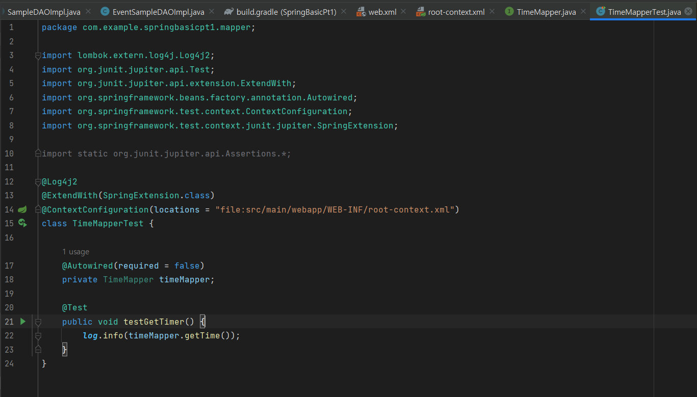

## 02. MyBatis와 스프링 연동
스프링 프레임워크의 중요한 특징 중 하나는 다른 프레임워크들을 쉽게 결합해서 사용할 수 있다는 점.

이것은 스프링 프레임워크가 웹이나 데이터베이스와 같이 특정한 영역을 구애받지 않고 시스템의 **객체지향 구조**를 만드는데 이용된다는 성격 때문.

스프링 프레임워크에서는 데이터베이스 관련 기능을 구현하기 위한 여려가지 방법들.

1) 'spring-jdbc'
2) MyBatis
3) JPA 프레임워크를 이용하는 방법

---

### 1. MyBatis 소개 

MyBatis는 'SQL Mapping Framework'로 불리며, SQL의 실행 결과를 객체지향 프로그래밍 언어로 매핑하는 기능을 제공합니다. 이를 통해 기존의 SQL을 그대로 사용하면서도 다음과 같은 여러 가지 편리한 기능을 이용할 수 있습니다:

- **PreparedStatement와 ResultSet 처리**: MyBatis는 파라미터 설정과 ResultSet에서 데이터를 추출하는 과정을 자동화하여, 개발자가 직접 작성해야 하는 코드의 양을 대폭 줄여줍니다.
- **자동 리소스 관리**: MyBatis를 스프링 프레임워크와 연동하면 Connection, PreparedStatement, ResultSet의 close 처리가 자동으로 이루어집니다.
- **SQL의 분리 및 관리**: SQL을 자바 코드에서 분리하여 별도의 파일이나 어노테이션을 통해 관리할 수 있습니다. 이는 SQL과 비즈니스 로직의 분리를 가능하게 하여 코드의 유지보수성을 향상시킵니다.

1. MyBatis와 스프링의 연동 방식
MyBatis는 단독으로도 실행이 가능한 완전히 독립적인 프레임워크이지만,
스프링 프레임워크는 MyBatis와 연동을 쉽게 처리할 수 있는 라이브러리와 API들을 제공.
스프링에서 제공하는 라이브러리를 이용하는지 여부에 따라서 다음과 같은 방식 중에 하나로 개발이 가능.
* MyBatis를 단독으로 개발하고 스프링에서 DAO를 작성해서 처리하는 방식
-> 기존의 DAO에서 SQL의 처리를 MyBatis를 이용하는 구조로써 완전히 MyBatis와 스프링 프레임워크를
독립적인 존재로 바라보고 개발하는 방식.
* MyBatis와 스프링을 연동하고 Mapper 인터페이스만 이용하는 방식
-> 스프링과 MyBatis 사이에 'mybatis-spring'이라는 라이브러리를 이용해서 스프링이 데이터베이스 전체에 대한 처리를 하고
MyBatis는 일부 기능 개발에 활용하는 방식.
개발 시에는 Mapper 인터페이스라는 방식을 이용해서 인터페이스만으로 모든 개발이 가능한 방식.


---

### 2. MyBatis와 스프링의 연동 방식

MyBatis는 단독으로 사용할 수 있는 독립적인 프레임워크이지만 
**스프링 프레임워크와 연동**할 때는 더 효율적인 개발이 가능합니다. 

스프링은 MyBatis와의 연동을 용이하게 해주는 라이브러리와 API를 제공하며, 개발 방식은 크게 두 가지로 나뉜다.

1. **MyBatis를 독립적으로 사용하며 스프링에서 DAO 처리**:
   - 이 방식에서는 MyBatis가 SQL 처리를 담당하고, 스프링은 DAO(Data Access Object)를 통해 데이터 접근 로직을 관리합니다. MyBatis와 스프링은 서로 독립적으로 작동하며, 기존의 DAO 구조에서 MyBatis를 사용하여 SQL을 처리합니다.

2. **MyBatis와 스프링을 직접 연동하여 Mapper 인터페이스 활용**:
   - `mybatis-spring` 라이브러리를 사용하여 스프링과 MyBatis를 직접 연동.
   
   - 이 방식에서는 스프링이 데이터베이스 처리의 전반을 담당하고, MyBatis는 특정 기능의 개발에 집중합니다. 
   
   - 개발은 Mapper 인터페이스를 통해 이루어지며, 이 인터페이스를 사용하여 SQL과 관련된 모든 개발이 가능한 방식.

---

### 3. MyBatis 를 위한 라이브러리 목록
MyBatis를 이용하려면 다음과 같은 라이브러리들이 필요.
- 스프링 관련 : spring-jdbc, spring-tx
- MyBatis 관련 : mybatis, mybatis-spring

다른 스프링 관련 라이브러리들과 버젼이 같도록 통일해서 추가.

지금까지 build.gradle 코드
```gradle
plugins {
    id 'java'
    id 'war'
}

group 'com.example'
version '1.0-SNAPSHOT'

repositories {
    mavenCentral()
}

ext {
    junitVersion = '5.8.2'
}

sourceCompatibility = '1.8'
targetCompatibility = '1.8'

tasks.withType(JavaCompile) {
    options.encoding = 'UTF-8'
}

dependencies {
    compileOnly('javax.servlet:javax.servlet-api:4.0.1')

    testImplementation("org.junit.jupiter:junit-jupiter-api:${junitVersion}")
    testRuntimeOnly("org.junit.jupiter:junit-jupiter-engine:${junitVersion}")

    // 1. Spring-core, spring-context, spring-test  추가
    // https://mvnrepository.com/artifact/org.springframework/spring-core
    implementation 'org.springframework:spring-core:5.3.30'
    implementation 'org.springframework:spring-context:5.3.30'
    implementation 'org.springframework:spring-test:5.3.30'
    // 웹과 과련된작업을 위해 추가
    // https://mvnrepository.com/artifact/org.springframework/spring-webmvc
    implementation 'org.springframework:spring-webmvc:5.3.30'

    // myBatis 를 위한 라이브러리 (스프링 관련)
    implementation 'org.springframework:spring-jdbc:5.3.30'
    implementation 'org.springframework:spring-tx:5.3.30'


    // 2. Lombok 라이브러리 추가
    // https://mvnrepository.com/artifact/org.projectlombok/lombok
    compileOnly 'org.projectlombok:lombok:1.18.22'
    annotationProcessor 'org.projectlombok:lombok:1.18.22'
    testCompileOnly 'org.projectlombok:lombok:1.18.22'
    testAnnotationProcessor 'org.projectlombok:lombok:1.18.22'

    // 3. log4j2 라이브러리 추가
    // https://mvnrepository.com/artifact/org.apache.logging.log4j/log4j-core
    implementation 'org.apache.logging.log4j:log4j-core:2.17.2'
    implementation 'org.apache.logging.log4j:log4j-api:2.17.2'
    implementation 'org.apache.logging.log4j:log4j-slf4j-impl:2.17.2'

    // 4. jstl 라이브러리 추가
    // https://mvnrepository.com/artifact/javax.servlet/jstl
    implementation 'javax.servlet:jstl:1.2'

    // DataSource 구성
    // 5. mariadb 라이브러리 추가
    // https://mvnrepository.com/artifact/org.mariadb.jdbc/mariadb-java-client
    implementation 'org.mariadb.jdbc:mariadb-java-client:3.1.4'

    // DataSource 구성
    // 6. HikariCP 라이브러리 추가
    // https://mvnrepository.com/artifact/com.zaxxer/HikariCP
    implementation 'com.zaxxer:HikariCP:5.0.1'

    // MyBatis 관련 라이브러리 1
    // https://mvnrepository.com/artifact/org.mybatis/mybatis
    implementation 'org.mybatis:mybatis:3.5.9'
    
    // MyBatis 관련 라이브러리 2
    // https://mvnrepository.com/artifact/org.mybatis/mybatis-spring
    implementation 'org.mybatis:mybatis-spring:2.0.7'


}

test {
    useJUnitPlatform()
}
```

---

### 4. MyBatis를 위한 스프링 설정
MyBatis를 이용하기 위해서는 스프링에 설정해둔 HikariDataSource를 이용해서
SqlSessionFactory라는 빈을 설정.

root-context.xml에 'mybatis-spring' 라이브러리에 있는 클래스를 이용해서 `<bean>`을 등록

<p align="center">
  
</p>

설정이 완료된 상황에서 프로젝트를 실행하고 정상적으로 실행되는지 확인.


---

### 5. Mapper 인터페이스 활용하기
MyBatis는 SQL 파일을 별도로 처리할 수 있지만 인터페이스와 어노테이션으로도 처리가 가능.

프로젝트에 mapper라는 이름의 패키지를 구성하고 현재 시간을 처리하는 TimeMapper 인터페이스를 선언

<p align="center">
  
</p>
<p align="center">
  
</p>

TimeMapper는 데이터베이스의 현재 시각을 문자열로 처리하도록 구성.

MyBatis에는 @Select 어노테이션을 이용해서 쿼리를 작성할 수 있는데,
JDBC와 마찬가지로 ";"을 이용하지 않으므로 주의.

작성된 인터페이스를 매퍼(Mapper) 인터페이스라고 하는데
마지막으로 어떠한 매퍼 인터페이스를 설정했는지 root-context.xml에 등록해 주어야 함.

root-context.xml에는 `<mybatis:scan>` 태그를 이용해서 매퍼 인터페이스의 설정을 추가.
root-context.xml 파일 상단의 xmlns, xsi 설정에 mybatis-spring 관련 설정이 추가 되어야 함.

참고로 now sql실행시

<p align="center">
  
</p>

<p align="center">
  
</p>

테스트코드를 통한 확인

test 폴더에 mapper 패키지와 TimeMapperTests 테스트 클래스를 작성해서 확인.
<p align="center">
  
</p>

<p align="center">
  
</p>

```java
package com.example.springbasicpt1.mapper;

import lombok.extern.log4j.Log4j2;
import org.junit.jupiter.api.Test;
import org.junit.jupiter.api.extension.ExtendWith;
import org.springframework.beans.factory.annotation.Autowired;
import org.springframework.test.context.ContextConfiguration;
import org.springframework.test.context.junit.jupiter.SpringExtension;

import static org.junit.jupiter.api.Assertions.*;

@Log4j2
@ExtendWith(SpringExtension.class)
@ContextConfiguration(locations = "file:src/main/webapp/WEB-INF/root-context.xml")
class TimeMapperTest {

    @Autowired(required = false)
    private TimeMapper timeMapper;

    @Test
    public void testGetTimer() {
        log.info(timeMapper.getTime());
    }
}
```

테스트 코드에서는 @Autowired 내에 required 속성을 지정.

`@Autowired(required = false)`로 지정하면 해당 객체를 주입 받지 못하도라도 예외가 발생하지 않는데
인텔리제이의 경우 @Service, @Repository 와 같이 직접 스프링의 빈으로 등록된 경우가 아니라면 경고가 발생하므로
이를 방지하기 위해서 사용.

MyBatis와 스프링을 연동하고 매퍼 인터페이스를 활용하는 방식은 개발자가 실제 동작하는 클래스와 객체를 생성하지 않고,
스프링에서 자동으로 생성되는 방식을 이용하게 됨.

스프링에서 자동으로 생성된 객체를 이용하기 때문에 개발자가 직접 코드를 수정할 수 없다는 단점이 있기는 하지만
인터페이스만으로도 개발을 완료할 수 있다는 장점이 있음.

테스트 코드를 실행하면 정상적으로 SQL이 처리되는것을 확인


<p align="center">
  
</p>

```gradle
10:34:46  INFO [com.example.springbasicpt1.mapper.TimeMapperTest] 2024-04-27 22:34:46
```
---

### 3. XML로 SQL 분리하기

MyBatis를 이용할 때 SQL은 @Select와 같은 어노테이션을 이용해서 사용하기도 함.

다만 대부분은 SQL을 별도의 파일로 분리하는 것을 권장.

XML을 이용하는 이유는 SQL이 길어지면 이를 어노테이션으로 처리하기가 복잡해지기 때문이기도 하고
어노테이션이 나중에 변경되면 프로젝트 전체를 다시 빌드하는 작업이 필요하기 때문에 단순 파일로 사용하는 것이 편리.

XML과 매퍼 인터페이스를 같이 결합할 때는 다음과 같은 과정으로 작성.

- 매퍼 인터페이스를 정의하고 메소드를 선언
- 해당 XML 파일을 작성 (파일 이름과 매퍼 인터페이스 이름을 같게)하고 `<select>`와 같은 태그를 이용해서 SQL을 작성.
- `<select>`, `<insert>` 등의 태그에 id 속성 값을 매퍼 인터페이스의 메소드 이름과 같게 작성.


TimeMapper2 매퍼 인터페이스를 정의

<p align="center">
  
</p>

```java
package com.example.springbasicpt1.mapper;

public interface TimeMapper2 {
    String getNow();
}
```

어노테이션이 없는 getNow() 메서드만 작성.

<p align="center">
  
</p>

`main/resources/` 폴더에 `mapper` 폴더를 추가 하고 `TimeMapper2.xml` 을 만들고 다음과 같이 작성.<br>
(매퍼 인터페이스와 같은 이름으로 대소문자 주의.)
-> 스프링 버젼이 업그레이드 되면서 인터페이스와 xml의 이름을 똑같이 하지 않아도 됨.

<mapper> 태그의 namespace 속성에서 매퍼 인터페이스를 맞게 지정하면 됨.
하지만 관리상의 목적으로 매퍼 인터페이스와 xml의 이름을 같게 하기도 함.)


```xml
<?xml version="1.0" encoding="UTF-8"?>
<!DOCTYPE mapper
        PUBLIC "-//mybatis.org//DTD Mapper 3.0//EN"
        "http://mybatis.org/dtd/mybatis-3-mapper.dtd">
<mapper namespace="com.example.springbasicpt1.mapper.TimeMapper2">
    <select id="getNow" resultType="string">
        select now()
    </select>
</mapper>

```

`<mapper>` 태그의 namespace 속성을 반드시 매퍼 인터페이스의 이름과 동일하게 지정.

`<select>` 태그는 반드시 resultType이나 resultMap이라는 속성을 지정해야만 함.

resultType은 말 그대로 select 문의 결과를 어떤 타입으로 처리할지에 대한 설정으로 java.lang.String과
같이 전체 이름을 써야 하지만 자주 사용하는 타입은 string과 같이 사용할 수 있음.

참고 : https://mybatis.org/mybatis-3/ko/configuration.html

마지막으로 root-context.xml에 있는 MyBatis 설정에 XML 파일들을 인식하도록 설정을 추가

<p align="center">
  
</p>

```xml
        <property name="mapperLocations" value="classpath:/mapper/**/*.xml" />
```
한줄만 추가하면된다.

추가된 mapperLocations는 말 그대로 'XML 매퍼 파일들의 위치'를 의미.

resources의 경우 'classpath:' 접두어를 이용해서 인식되는 경로이고
mapper 폴더 및에 폴더가 있어도 관계없도록 '**'와
모든 '.xml'을 의미라는 '*.xml'을 지정.

XML 설정이 정상적인지 테스트를 통해서 확인.

기존에 만들어진 TimeMapperTests를 이용


```java
package com.example.springbasicpt1.mapper;

import lombok.extern.log4j.Log4j2;
import org.junit.jupiter.api.Test;
import org.junit.jupiter.api.extension.ExtendWith;
import org.springframework.beans.factory.annotation.Autowired;
import org.springframework.test.context.ContextConfiguration;
import org.springframework.test.context.junit.jupiter.SpringExtension;

import static org.junit.jupiter.api.Assertions.*;

@Log4j2
@ExtendWith(SpringExtension.class)
@ContextConfiguration(locations = "file:src/main/webapp/WEB-INF/root-context.xml")
class TimeMapperTest {

    @Autowired(required = false)
    private TimeMapper timeMapper;

    @Autowired(required = false)

    private TimeMapper2 timeMapper2;

    @Test
    public void testGetTimer() {
        log.info(timeMapper.getTime());
    }

    @Test
    public void testGetTimer1(){
        log.info(timeMapper2.getNow());
    }


}
```
<p align="center">
  
</p>
실행 결과를 확인해서 정상적으로 모든 설정이 완료되었는지 확인.

과거에는 MyBatis를 단독을 이용하는 경우가 간혹 있었지만

최근 프로젝트에서는 스프링과 MyBatis의 연동은 기본 설정처럼 사용되고 있으므로 반드시 문제가 없는지 확인해 주어야 함.


```log
11:08:10  INFO [com.example.springbasicpt1.mapper.TimeMapperTest] 2024-04-27 23:08:10
```
