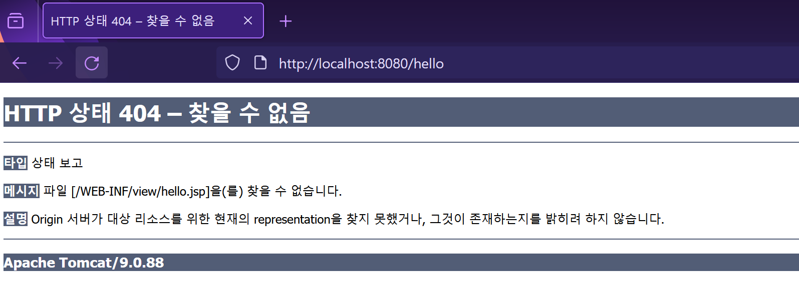
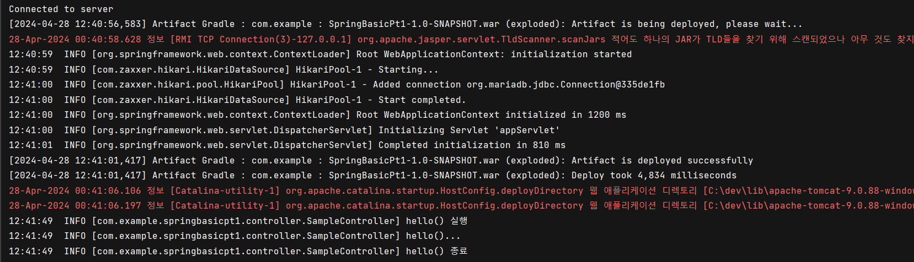

## 1. 스프링 Web MVC 개요
- 스프링 Web MVC는 서블릿 API를 추상화하여 더욱 강력하고 유연한 웹 애플리케이션 개발을 지원합니다.
- 주요 구성 요소로는 `DispatcherServlet`, 컨트롤러, 뷰 리졸버 등이 있습니다.
- MVC 패턴을 적극적으로 활용하며, 어노테이션 기반의 구성을 통해 생산성과 안정성을 향상시킵니다.

### 주요 특징 및 구성
1. **Front-Controller 패턴 사용**
   - 모든 웹 요청 처리를 중앙에서 `DispatcherServlet`을 통해 관리하여 공통 처리가 가능하게 합니다.
   
2. **어노테이션 활용**
   - `@Controller`, `@GetMapping`, `@PostMapping` 등의 어노테이션을 통해 라우팅 및 요청 처리를 간소화합니다.

3. **뷰 리졸버 설정**
   - `InternalResourceViewResolver`를 사용하여 요청에 따른 뷰 파일을 해석하고 응답을 생성합니다.

### 설정과 구현
1. **XML 및 자바 기반 설정**
   - `servlet-context.xml`에서 컴포넌트 스캔, 뷰 리졸버, 정적 자원 경로 등을 설정합니다.
   - `web.xml`에서 `DispatcherServlet`을 등록하고 초기화합니다.

2. **컨트롤러 구현**
   - 간단한 `@Controller`로 요청을 처리하며, 다양한 HTTP 메소드와 경로를 어노테이션을 통해 관리합니다.

3. **파라미터 수집 및 변환**
   - 요청에서 자동으로 파라미터를 수집하고 변환하는 기능을 제공하여 개발을 용이하게 합니다.

---

## 2. 스프링 MVC 사용하기
spring-webmvc 라이브러리는 미리 추가되었으므로
스프링 MVC관련 설정을 추가.

WEB-INF 폴더에 `servlet-context.xml` 파일을 생성

root-context.xml을 이용할 수도 있지만,
일반적으로는 구조를 분리하듯이 웹을 다루는 영역이라 별도의 설정 파일을 이용하는 것이 일반적.

프로젝트 내부의 webapp 폴더 아래에 `resources`라는 폴더를 하나 더 생성해 둠

나중에 정적 파일들(html, css, js, 이미지등)을 서비스하기 위한 경로.

<p align="center">
  
</p>


### 1. `servlet-context.xml` 의 설정

<p align="center">
  
</p>

```xml
<?xml version="1.0" encoding="ISO-8859-1"?>

<beans xmlns="http://www.springframework.org/schema/beans"
       xmlns:xsi="http://www.w3.org/2001/XMLSchema-instance"
       xmlns:mvc="http://www.springframework.org/schema/mvc"
       xsi:schemaLocation="http://www.springframework.org/schema/beans
        http://www.springframework.org/schema/beans/spring-beans.xsd
        http://www.springframework.org/schema/mvc
        https://www.springframework.org/schema/mvc/spring-mvc.xsd ">

    <mvc:annotation-driven/>
    <mvc:resources mapping="/resources/**" location="/resources/" />
    <bean class="org.springframework.web.servlet.view.InternalResourceViewResolver">
        <property name="prefix" value="/WEB-INF/view/"/>
        <property name="suffix" value=".jsp"/>
    </bean>

</beans>
```

`<mvc:annotation-driven>` 설정은 스프링 MVC 설정을 어노테이션 기반으로 처리한다는 의미와
스프링 MVC의 여러 객체들을 자동으로 스프링의 빈으로 등록하게 하는 기능을 의미.

`<mvc:resources>` 설정은 이미지나 html 파일과 같이 정적인 파일의 경로를 지정.

`/resources` 경로로 들어오는 요청은 정적 파일을 요구하는 것이라고 생각하고 스프링 MVC에서 처리하지 않는다는 의미.

`location` 속성 값은 webapp 폴더에서 만들어둔 폴더를 의미.

`InternalResourceViewResolver`라는 이름의 클래스로 빈이 설정되어 있는데
`InternalResourceViewResolver`는 스프링 MVC에서 제공하는 뷰(view)를 어떻게 결정하는지에 대한 설정을 담당.

prefix와 suffix의 내용을 보면 뷰를 이용할때 파일명만 주어지면 조합해서 `'/WEB-INF/view/파일명.jsp'` 같은 형식을 만들
수 있음.


### 2. web.xml의 DispatcherServlet 설정


스프링 MVC를 실행하려면 프론트 콘트롤러 역할을 하는 `DispatcherServlet`을 설정해야함.<br>
-> web.xml을 이용해서 처리.

```xml
    <context-param>
        <param-name>contextConfigLocation</param-name>
        <param-value>/WEB-INF/root-context.xml</param-value>
    </context-param>

    <listener>
        <listener-class>org.springframework.web.context.ContextLoaderListener</listener-class>
    </listener>

    <!-- DispatcherServlet 설정 -->
    <servlet>
        <servlet-name>appServlet</servlet-name>
        <servlet-class>org.springframework.web.servlet.DispatcherServlet</servlet-class>
        <init-param>
            <param-name>contextConfigLocation</param-name>
            <param-value>/WEB-INF/servlet-context.xml</param-value>
        </init-param>
        <load-on-startup>1</load-on-startup>
    </servlet>
    <servlet-mapping>
        <servlet-name>appServlet</servlet-name>
        <url-pattern>/</url-pattern>
    </servlet-mapping>
```

`<servlet>` 설정과 `<servlet-mapping>` 설정이 추가.

<servlet> 설정은 DispatcherServlet을 등록하는데 DispatcherServlet이 로딩할 때 servlet-context.xml을 이용하도록 설정.

load-on-startup 설정의 경우 톰캣 로딩 시에 클래스를 미리 로딩해 두기 위한 설정.
<servlet-mapping> 설정은 모든 경로의 요청에 대한 처리를 담당하기 때문에 `'/'`로 지정


프로젝트를 실행해서 발생하는 로그에 스프링 관련 로그글이 출력되는지 확인.


<p align="center">
  
</p>
<p align="center">
  
</p>


## 3. 스프링 MVC 컨트롤러
스프링 MVC 컨트롤러는 전통적인 자바의 클래스 구현 방식과 여러모로 상당히 다름.

과거의 많은 프레임워크들은 상속이나 인터페이스 기반으로 구현되는 방식을 선호 했다면
스프링 MVC의 컨트롤러 특징은 아래와 같음.

* 상속이나 인터페이스를 구현하는 방식을 사용하지 않고 **어노테이션만으로 처리**가 가능.
* **오버라이드 없이** 필요한 메소드들을 정의
* 메소드의 파라미터를 기본 자료형이나 객체 자료형을 마음대로 지정.
* 메소드의 리턴타입도 void, String, 객체 등 다양한 타입을 사용할 수 있음.


controller 패키지를 추가하고 SampleController 클래스를 추가.

<p align="center">
  
</p>


SampleController 코드 작성
```java
package com.example.springbasicpt1.controller;

import lombok.extern.log4j.Log4j2;
import org.springframework.stereotype.Controller;
import org.springframework.web.bind.annotation.GetMapping;

@Log4j2
@Controller
public class SampleController {
    
    @GetMapping("hello")
    public void hello() {
        log.info("hello() 실행");
        log.info("hello()...");
        log.info("hello() 종료");
    }
}
```
몇 가지 특이한 어노테이션들이 사용.

`@Controller`는 해당 클래스가 **스프링 MVC에서 컨트롤러 역할**을 한다는 것을 의미하고 스프링의 빈으로 처리되기 위해서 사용.

`@GetMapping`은 GET 방식으로 들어오는 요청을 위해 사용

#### 1. servlet-context.xml의 component-scan
controller 패키지에 존재하는 **컨트롤러 클래스들을 스프링으로 인식**하기 위해서는 해당 패키지를 스캔해서
`@Controller` 어노테이션이 추가된 클래스들의 객체들을 스프링이 빈으로 설정되게 만들어야 함.

servlet-context.xml에 component-scan을 적용

`servlet-context.xml`

```xml
<?xml version="1.0" encoding="ISO-8859-1"?>

<beans xmlns="http://www.springframework.org/schema/beans"
       xmlns:xsi="http://www.w3.org/2001/XMLSchema-instance"
       xmlns:mvc="http://www.springframework.org/schema/mvc"
       xmlns:context="http://www.springframework.org/schema/context"
       xsi:schemaLocation="http://www.springframework.org/schema/beans
        http://www.springframework.org/schema/beans/spring-beans.xsd
        http://www.springframework.org/schema/mvc
        https://www.springframework.org/schema/mvc/spring-mvc.xsd 
        http://www.springframework.org/schema/context 
        https://www.springframework.org/schema/context/spring-context.xsd ">

    <mvc:annotation-driven/>
    <mvc:resources mapping="/resources/**" location="/resources/" />
    <bean class="org.springframework.web.servlet.view.InternalResourceViewResolver">
        <property name="prefix" value="/WEB-INF/view/"/>
        <property name="suffix" value=".jsp"/>
    </bean>
    
    <context:component-scan base-package="com.example.springbasicpt1.controller" />

</beans>
```


<p align="center">
  
</p>

톰캣 실행을 해서 `/hello` 경로를 호출 했을 때 아래와 같이 나오는지 확인

<p align="center">
  
</p>


404에러에 /WEB-INF/view/hello.jsp 파일이 존재하지 않기 때문에 발생.

<p align="center">
  
</p>


로그상으론 실행되고는 있음. jsp가 없어서 생기는 문제이기 떄문.

WEB-INF에 view 폴더 생성후 hello.jsp 작성.

메시지항목이 안뜬다면 톰캣 설정을 다시 설정.(1일차)

<p align="center">
  
</p>

hello.jsp
```jsp
<%@ page contentType="text/html;charset=UTF-8" language="java" %>
<html>
<head>
    <title>Title</title>
</head>
<body>
    <h1>Hello JSP !!! </h1>

</body>
</html>
```
그리고 다시 톰캣 실행

<p align="center">
  
</p>

<p align="center">
  
</p>

### 2. @RequestMapping과 파생 어노테이션들

스프링 컨트롤러에서 가장 많이 사용하는 어노테이션은 `@RequestMapping`

@RequestMapping은 말 그대로 '특정한 경로의 요청 Request을 지정'하기 위해서 사용.
@RequestMapping은 컨트롤러 클래스의 선언부에도 사용할 수 있고, 컨트롤러의 메서드에도 사용할 수 있음.

controller 패키지에 TodoController 클래스 추가

<p align="center">
  
</p>

TodoController.java
```java
package com.example.springbasicpt1.controller;

import lombok.extern.log4j.Log4j2;
import org.springframework.stereotype.Controller;
import org.springframework.web.bind.annotation.RequestMapping;
import org.springframework.web.bind.annotation.RequestMethod;

@Controller
@RequestMapping("/todo")
@Log4j2
public class TodoController {
    @RequestMapping("/list")
    public void list() {
        log.info("todo list...컨트롤러");
    }

    @RequestMapping(value = "/register",method = RequestMethod.GET)
    public void register() {
        log.info("todo register...컨트롤러");
    }
}

```
TodoController의 @RequestMapping의 value 값은 '/todo'이고 list()는 '/list'이므로 최종경로는 `'/todo/list'` 가 됨

JSP 파일이 없어서 에러가 나지만 로그 출력은 확인

<p align="center">
  
</p>


`@RequestMapping`을 이용하는 것만으로도 여러 개의 컨트롤러를 하나의 클래스로 묶을 수 있고,
각 기능을 메소드 단위로 설계할 수 있게 되므로 실제 개발에서 많은 양의 코드를 줄일 수 있음.

`@RequestMapping`에는 method 속성을 이용해서 `GET` / `POST` 방식을 구분해서 처리했지만,

스프링 4버전 이후에는 `@GetMapping`, `@PostMapping` 어노테이션이 추가되면서 GET / POST 방식을 구분해서 처리할 수 있게 됨.

예를 들어 Todo 등록의 경우 `GET` 방식으로 '/todo/register'를 이용하면 입력 가능한 화면을 보여주고,
POST방식은 처리를 해야 함.

```java
package com.example.springbasicpt1.controller;

import lombok.extern.log4j.Log4j2;
import org.springframework.stereotype.Controller;
import org.springframework.web.bind.annotation.PostMapping;
import org.springframework.web.bind.annotation.RequestMapping;
import org.springframework.web.bind.annotation.RequestMethod;

@Controller
@RequestMapping("/todo") // 여러 개의 컨트롤러를 하나의 클래스로 묶음
@Log4j2
public class TodoController {
    @RequestMapping("/list")
    public void list() {
        log.info("todo list...컨트롤러");
    }

    @RequestMapping(value = "/register",method = RequestMethod.GET)
    public void register() {
        log.info("todo register...컨트롤러");
    }

    @PostMapping("/register")
    public void registerPOST(){
        log.info("POST todo register");
    }
}

```

---

### 3. 파라미터 자동 수집과 변환
스프링 MVC가 인기를 끌게 된 여러 이유 중에는 개발 시간을 단축할 수 있는 편리한 기능들이 많기 때문.

개발자들에게 가장 필요한 파라미터 자동 수집 기능.

파라미터 자동 수집 기능은 간단히 말해서 `DTO`나 `VO`등을 메서드의 파라미터로 설정하면
자동으로 전달되는 HttpServletRequest의 파라미터들을 수집해 주는 기능.

단순히 문자열만이 아니라 숫자도 가능하고, 배열이나 리스트, 첨부 파일도 가능.
파라미터 수집은 다음과 같은 기준으로 동작.

* 기본 자료형의 경우는 자동으로 형 변환처리가 가능
* 객체 자료형의 경우는 setXXX()의 동작을 통해서 처리
* 객체 자료형의 경우 생성자가 없거나 파라미터가 없는 생성자가 필요.


### 1. 단순 파라미터의 자동 수집
SampleController에 ex1() 추가

<p align="center">
  
</p>
문자열 name과 int 타입의 age 선언

브라우저를 이용해서 name과 age를 지정하면 'ex1?name=aaa&age=16'와 같이 호출 되었 을 때 자동으로 처리되는 것 확인.


`http://localhost:8080/todo/ex1?name=abc&age=16`


<p align="center">
  
</p>

<p align="center">
  
</p>

- `@RequestParam`

스프링 MVC의 파라미터는 기본적으로 요청 request에 전달된 파라미터 이름을 기준으로 동작하지만
파라미터가 전달되지 않으면 문제가 발생.
@RequestParam은 defaultValue라는 속성이 있어서 '기본값'을 지정할 수 있음.