## 01. 프로젝트의 구현 목표와 준비

### 목표 
스프링과 MyBatis, 스프링 MVC를 모두 결합하는 구조
todo를 CRUD 기능을 개발하고 목록은 페이징 처리와 검색 기능을 구현

### 1. 프로젝트의 구현 목표와 준비

- 검색과 필터링을 적용할 수 있는 화면을 구성하고 MyBatis의 동적 쿼리를 이용해서 상황에 맞는 Todo들을 검색.
- 새로운 Todo를 등록할 때 문자열, boolean, LocalDate를 자동으로 처리.
- 목록에서 조회 화면으로 이동할 때 모든 검색, 필터링, 페이징 조건을 유지하도록 구성.
- 조회 화면에서는 모든 조건을 유지한 채로 수정 / 삭제 화면으로 이동하도록 구성.
- 삭제 시에는 다시 목록 화면으로 이동.
- 수정 시에는 다시 조회 화면으로 이동하지만, 검색, 필터링, 페이징 조건은 초기화


#### build.gradle 
```gradle
plugins {
    id 'java'
    id 'war'
}

group 'com.example'
version '1.0-SNAPSHOT'

repositories {
    mavenCentral()
}

ext {
    junitVersion = '5.8.2'
}

sourceCompatibility = '1.8'
targetCompatibility = '1.8'

tasks.withType(JavaCompile) {
    options.encoding = 'UTF-8'
}

dependencies {
    compileOnly('javax.servlet:javax.servlet-api:4.0.1')

    testImplementation("org.junit.jupiter:junit-jupiter-api:${junitVersion}")
    testRuntimeOnly("org.junit.jupiter:junit-jupiter-engine:${junitVersion}")

    // 스프링 관련
    // 1. Spring-core, spring-context, spring-test  추가
    // https://mvnrepository.com/artifact/org.springframework/spring-core
    implementation 'org.springframework:spring-core:5.3.30'
    implementation 'org.springframework:spring-context:5.3.30'
    implementation 'org.springframework:spring-test:5.3.30'
    // 웹과 과련된작업을 위해 추가
    // https://mvnrepository.com/artifact/org.springframework/spring-webmvc
    implementation 'org.springframework:spring-webmvc:5.3.30'

    // myBatis 를 위한 라이브러리 (스프링 관련)
    implementation 'org.springframework:spring-jdbc:5.3.30'
    implementation 'org.springframework:spring-tx:5.3.30'
    // 스프링 관련 END


    // 2. Lombok 라이브러리 추가
    // https://mvnrepository.com/artifact/org.projectlombok/lombok
    compileOnly 'org.projectlombok:lombok:1.18.22'
    annotationProcessor 'org.projectlombok:lombok:1.18.22'
    testCompileOnly 'org.projectlombok:lombok:1.18.22'
    testAnnotationProcessor 'org.projectlombok:lombok:1.18.22'

    // 3. log4j2 라이브러리 추가
    // https://mvnrepository.com/artifact/org.apache.logging.log4j/log4j-core
    implementation 'org.apache.logging.log4j:log4j-core:2.17.2'
    implementation 'org.apache.logging.log4j:log4j-api:2.17.2'
    implementation 'org.apache.logging.log4j:log4j-slf4j-impl:2.17.2'

    // 4. jstl 라이브러리 추가
    // https://mvnrepository.com/artifact/javax.servlet/jstl
    implementation 'javax.servlet:jstl:1.2'

    // MyBatis / Maria DB / HikariCP 관련
    // DataSource 구성
    // 5. mariadb 라이브러리 추가
    // https://mvnrepository.com/artifact/org.mariadb.jdbc/mariadb-java-client
    implementation 'org.mariadb.jdbc:mariadb-java-client:3.1.4'

    // DataSource 구성
    // 6. HikariCP 라이브러리 추가
    // https://mvnrepository.com/artifact/com.zaxxer/HikariCP
    implementation 'com.zaxxer:HikariCP:5.0.1'

    // MyBatis 관련 라이브러리 1
    // https://mvnrepository.com/artifact/org.mybatis/mybatis
    implementation 'org.mybatis:mybatis:3.5.9'

    // MyBatis 관련 라이브러리 2
    // https://mvnrepository.com/artifact/org.mybatis/mybatis-spring
    implementation 'org.mybatis:mybatis-spring:2.0.7'

    // MyBatis / Maria DB / HikariCP 관련 END

    // DTO와 VO의 변환을 위한 ModelMapper
    // https://mvnrepository.com/artifact/org.modelmapper/modelmapper
    implementation 'org.modelmapper:modelmapper:3.0.0'

    // DTO의 검증을 위한 validate 관련 라이브러리
    // https://mvnrepository.com/artifact/org.hibernate.validator/hibernate-validator
    implementation 'org.hibernate.validator:hibernate-validator:6.2.1.Final'
    
}

test {
    useJUnitPlatform()
}
```

#### 2. 프로젝트 폴더 / 패키지 구조

1. 테이블 작업

<p align="center">
  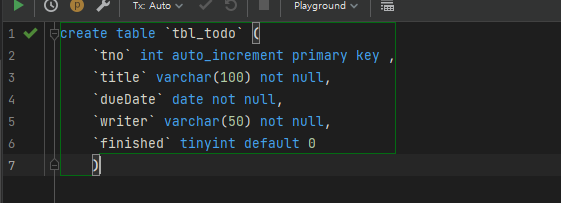
</p>

<p align="center">
  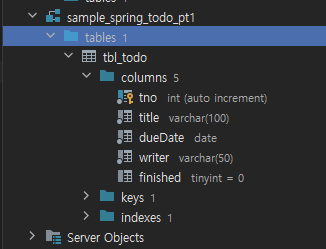
</p>


2. 폴더 구조 


<p align="center">
  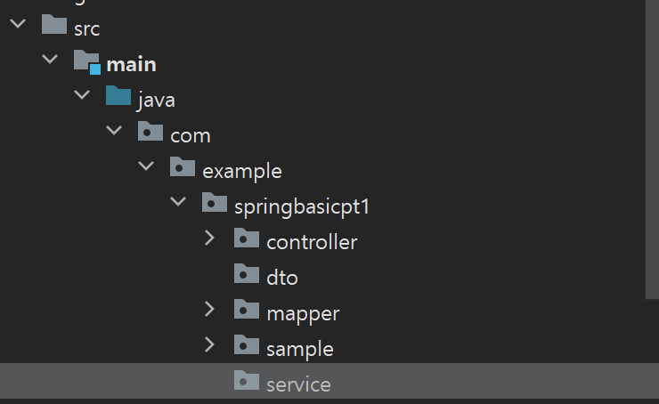
</p>


### 3. 3. ModelMapper 설정과 @Configuration

프로젝트 개발에는 `DTO`를 `VO`로 변환하거나 `VO`를 `DTO`로 변환해야 하는 작업이 빈번하므로

이를 처리하기 위해서 ModelMapper를 스프링의 빈으로 등록해서 처리.

config 패키지를 추가하고 ModelMapperConfig 클래스 추가

<p align="center">
  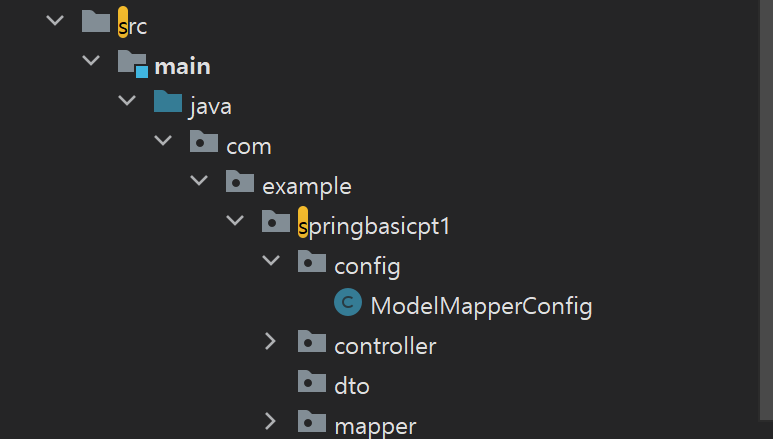
</p>


ModelMapperConfig는 @Configuration을 이용.

> @Configuration은 해당 클래스가 스프링 빈에 대한 설정을 하는 클래스임을 명시.

ModelMapperConfig.java

```java
package com.example.springbasicpt1.config;

import org.modelmapper.ModelMapper;
import org.modelmapper.convention.MatchingStrategies;
import org.modelmapper.spi.MatchingStrategy;
import org.springframework.context.annotation.Bean;
import org.springframework.context.annotation.Configuration;

@Configuration
public class ModelMapperConfig {

    @Bean
    public ModelMapper getMapper() {
        ModelMapper modelMapper = new ModelMapper();
        modelMapper.getConfiguration()
                .setFieldMatchingEnabled(true)
                .setFieldAccessLevel(org.modelmapper.config.Configuration.AccessLevel.PRIVATE)
                .setMatchingStrategy(MatchingStrategies.STRICT);

        return modelMapper;
    }
}
```

ModelMapperConfig를 스프링 **빈으로 인식**할 수 있도록 root-context.xml에 config 패키지를 component-scan을 이용해서 추가.


<p align="center">
  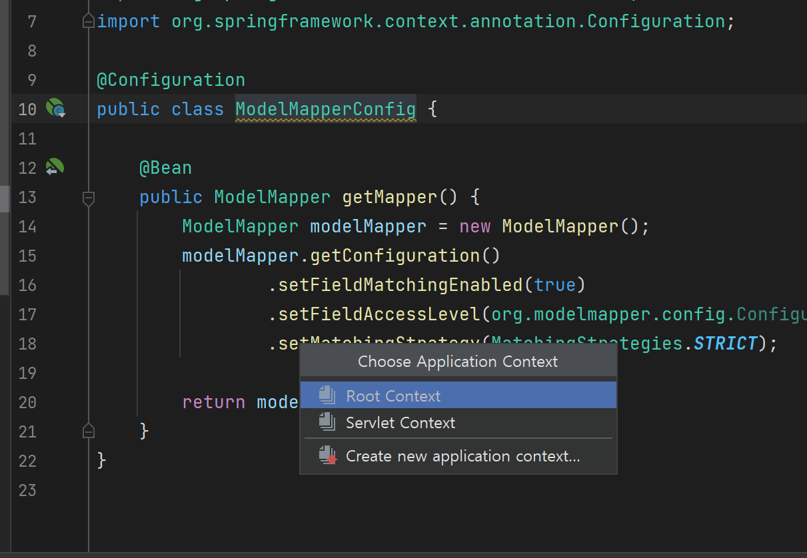
</p>


root-context.xml

<p align="center">
  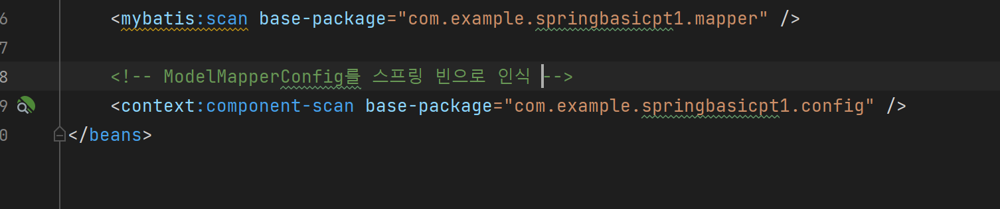
</p>


ModelMapperConfig 클래스 내에는 getMapper()라는 메서드가 ModelMapper를 반환하도록 설계.

중요한 점은 getMapper() 선언부에 있는 @Bean 어노테이션.
@Bean은 해당 메서드의 실행 결과로 반환된 객체를 스프링의 빈으로 등록시키는 역할.


---

## 02. 화면 디자인 - 부트스트랩 적용

JSP 파일을 작성하기 전, 프로젝트의 시작 단계에서 화면 디자인을 결정하는 것이 좋음.

화면 디자인 없이 개발을 진행할 때는 나중에 코드를 다시 입혀야 하는 작업을 할 수도 있기 때문.

- 최근에는 부트스트랩 (bootstrap)이나 머터리얼(Material Design)과 같이 쉽게 웹 화면을 디자인할 수 있는
라이브러리들 덕분에 전문적인 웹 디자이너의 도움 없이도 어느정도 완성도가 있는 디자인 작업이 가능해 짐.

실제 프로젝트에서는 완성도 높은 무료 혹은 유료 디자인을 선정해서 사용하기도 함

https://elements.envato.com/web-templates/site-templates

webapp의 resources 폴더에 test.html을 작성해서 부트스트랩을 적용하는 페이지를 작성

```html
<!doctype html>
<html lang="en">
<head>
    <!-- Required meta tags -->
    <meta charset="utf-8">
    <meta name="viewport" content="width=device-width, initial-scale=1">

    <!-- Bootstrap CSS -->
    <link href="https://cdn.jsdelivr.net/npm/bootstrap@5.1.3/dist/css/bootstrap.min.css" rel="stylesheet"
          integrity="sha384-1BmE4kWBq78iYhFldvKuhfTAU6auU8tT94WrHftjDbrCEXSU1oBoqyl2QvZ6jIW3" crossorigin="anonymous">

    <title>Hello, world!</title>
</head>
<body>
<!--<h1>Hello, world!</h1>-->
<div class="container-fluid">
    <div class="row">
        <nav class="navbar navbar-expand-lg navbar-light bg-light">
            <div class="container-fluid">
                <a class="navbar-brand" href="#">Navbar</a>
                <button class="navbar-toggler" type="button" data-bs-toggle="collapse"
                        data-bs-target="#navbarNavAltMarkup" aria-controls="navbarNavAltMarkup" aria-expanded="false"
                        aria-label="Toggle navigation">
                    <span class="navbar-toggler-icon"></span>
                </button>
                <div class="collapse navbar-collapse" id="navbarNavAltMarkup">
                    <div class="navbar-nav">
                        <a class="nav-link active" aria-current="page" href="#">Home</a>
                        <a class="nav-link" href="#">Features</a>
                        <a class="nav-link" href="#">Pricing</a>
                        <a class="nav-link disabled">Disabled</a>
                    </div>
                </div>
            </div>
        </nav>
        <!--       기존의 헤더 <h1>Header</h1>-->
        <div class="row content">
            <div class="col">
                <div class="card">
                    <div class="card-header">
                        Featured
                    </div>
                    <div class="card-body">
                        <h5 class="card-title">Special title treatment</h5>
                        <p class="card-text">With supporting text below as a natural lead-in to additional content.</p>
                        <a href="#" class="btn btn-primary">Go somewhere</a>
                    </div>
                </div>
            </div>
            <!--            <h1>Content</h1>-->
        </div>
    </div>
    <div class="row footer">
<!--        <h1>Footer</h1>-->
        <div class="row fixed-bottom" style="z-index: -100">
            <footer class="py-1 my-1 ">
                <p class="text-center text-muted">Footer</p>
            </footer>
        </div>
    </div>
</div>
<script src="https://cdn.jsdelivr.net/npm/bootstrap@5.1.3/dist/js/bootstrap.bundle.min.js"
        integrity="sha384-ka7Sk0Gln4gmtz2MlQnikT1wXgYsOg+OMhuP+IlRH9sENBO0LRn5q+8nbTov4+1p"
        crossorigin="anonymous"></script>

</body>
</html>
```
html의 내용을 Starter template 내용으로 변경.
주석은 삭제

프로젝트를 실행해서 /resources/test.html 을 브라우저로 확인

`http://localhost:8080/resources/test.html`


<p align="center">
  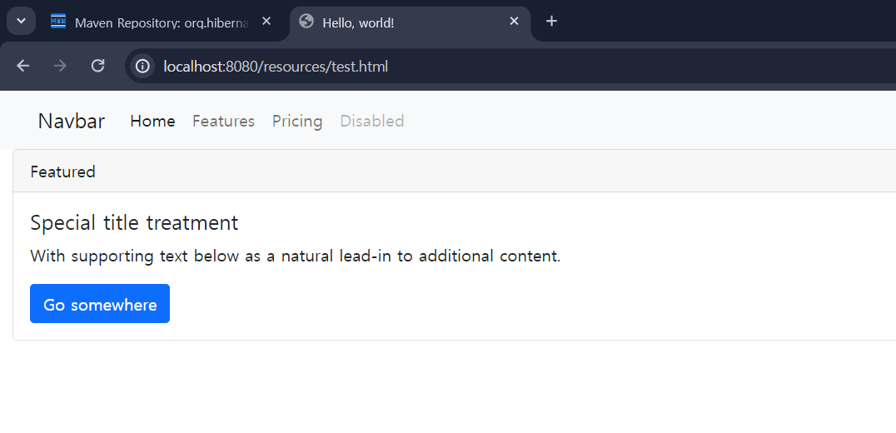
</p>


---

## 03. MyBatis와 스프링을 이용한 처리

프로젝트 개발은 데이터베이스 처리부터 시작.

MyBatis와 스프링을 연동하기 때문에 기존의 JDBC에 비해서 적은 양의 코드만으로 개발이 가능.

MyBatis를 이용하는 개발 단계

1. VO 선언
2. Mapper 인터페이스의 개발
3. XML의 개발
4. 테스트 코드의 개발
프로젝트에 domain 패키지를 생성하고 TodoVO 클래스를 추가


<p align="center">
  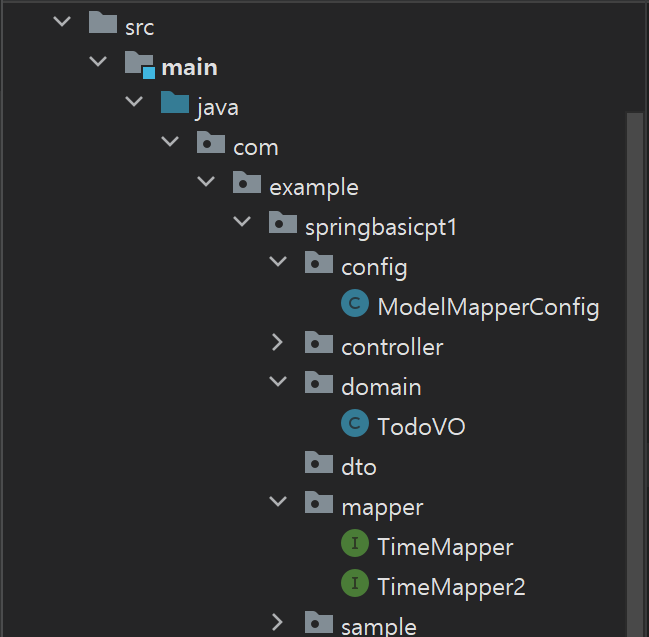
</p>


`TodoVO.java`
```java
package com.example.springbasicpt1.domain;

import lombok.*;

import java.time.LocalDate;

@Getter
@ToString
@AllArgsConstructor
@NoArgsConstructor
@Builder
public class TodoVO {
    private Long tno;
    private String title;
    private LocalDate dueDate;
    private String writer;
    private boolean finished;
}

```

1. TodoMapper 인터페이스와 XML

TodoVO는 매퍼 인터페이스의 파라미터나 리턴 타입이 될 수 있기 때문에 먼저 정의하고

이를 이용해서 mapper 패키지에 TodoMapper
인터페이스를 정의.


<p align="center">
  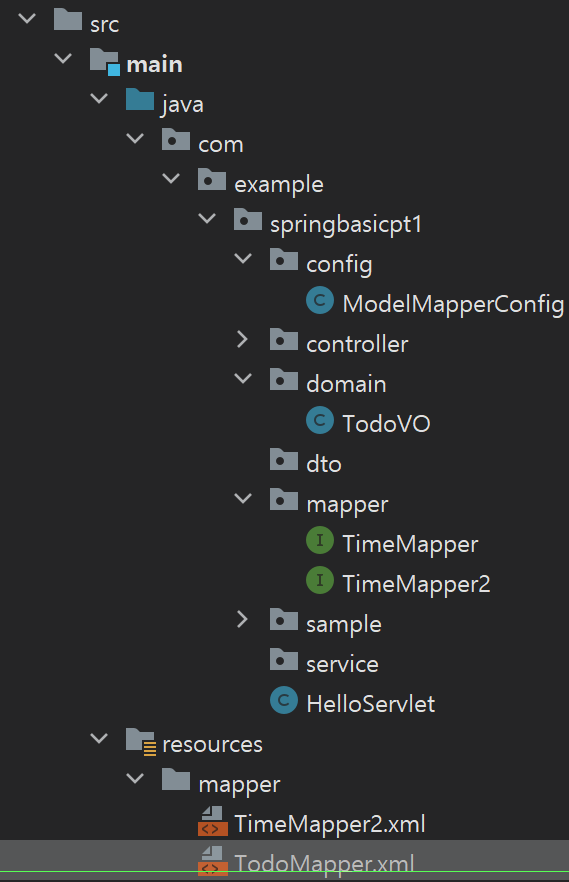
</p>


<p align="center">
  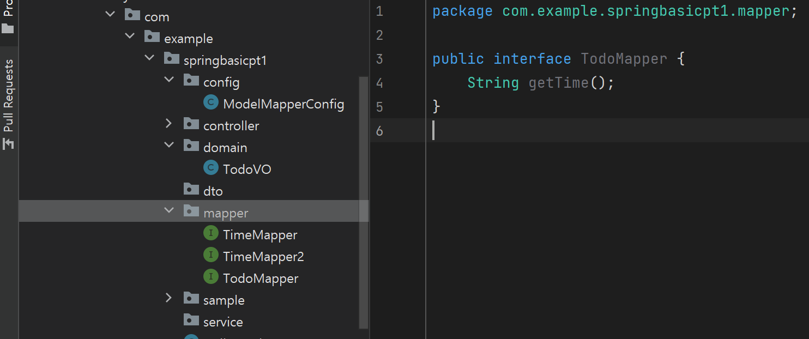
</p>


```java
package com.example.springbasicpt1.mapper;

public interface TodoMapper {
    String getTime();
}
```
resources/mapper 폴더에 TodoMapper.xml을 선언하고 getTime()에 해당하는 내용을 작성.


```xml
<?xml version="1.0" encoding="UTF-8" ?>
<!DOCTYPE mapper
        PUBLIC "-//mybatis.org//DTD Mapper 3.0//EN"
        "http://mybatis.org/dtd/mybatis-3-mapper.dtd">
<mapper namespace="com.example.spring_basic.mapper.TodoMapper">
    <!-- MyBatis 매핑 파일로, 데이터베이스 작업을 위한 SQL 쿼리와 이를 실행할 메서드를 정의 -->
    <select id="getTime" resultType="string">
        <!-- id는 메소드 이름과 매핑, 실행 결과는 string 타입 -->
        select now() <!-- 현재 시각을 반환하는 SQL 쿼리 -->
    </select>
    
</mapper>
```
<p align="center">
  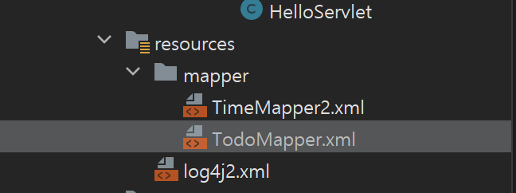
</p>


> 주의
> XML을 작성할 때 namespace 값은 인터페이스의 이름, 메서드의 이름은 `<select>` 태그의 id와 반드시 일치.


테스트 코드 작성
TodoMapperTest.java

```java
package com.example.springbasicpt1.mapper;

import lombok.extern.log4j.Log4j2;
import org.junit.jupiter.api.Test;
import org.junit.jupiter.api.extension.ExtendWith;
import org.springframework.beans.factory.annotation.Autowired;
import org.springframework.test.context.ContextConfiguration;
import org.springframework.test.context.junit.jupiter.SpringExtension;

import static org.junit.jupiter.api.Assertions.*;

@Log4j2
@ExtendWith(SpringExtension.class)
@ContextConfiguration(locations = "file:src/main/webapp/WEB-INF/root-context.xml")
class TodoMapperTest {

    @Autowired(required = false)
    private TodoMapper todoMapper;

    @Test
    public void testGetTime() {
        log.info(todoMapper.getTime());
    }
}
```

실행

<p align="center">
  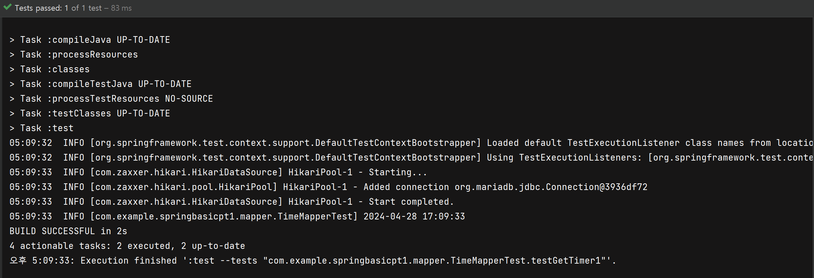
</p>


```log
05:09:33  INFO [com.zaxxer.hikari.HikariDataSource] HikariPool-1 - Starting...
05:09:33  INFO [com.zaxxer.hikari.pool.HikariPool] HikariPool-1 - Added connection org.mariadb.jdbc.Connection@3936df72
05:09:33  INFO [com.zaxxer.hikari.HikariDataSource] HikariPool-1 - Start completed.
05:09:33  INFO [com.example.springbasicpt1.mapper.TimeMapperTest] 2024-04-28 17:09:33
```

현재는 로그가 간단하게 나오는데 조금 더 자세히 보고 싶다면 log4j2.xml을 아래와 같이 수정한다.
 
```xml
package com.example.springbasicpt1.mapper;

import lombok.extern.log4j.Log4j2;
import org.junit.jupiter.api.Test;
import org.junit.jupiter.api.extension.ExtendWith;
import org.springframework.beans.factory.annotation.Autowired;
import org.springframework.test.context.ContextConfiguration;
import org.springframework.test.context.junit.jupiter.SpringExtension;

import static org.junit.jupiter.api.Assertions.*;

@Log4j2
@ExtendWith(SpringExtension.class)
@ContextConfiguration(locations = "file:src/main/webapp/WEB-INF/root-context.xml")
class TodoMapperTest {

    @Autowired(required = false)
    private TodoMapper todoMapper;

    @Test
    public void testGetTime() {
        log.info(todoMapper.getTime());
    }
}
```

<p align="center">
  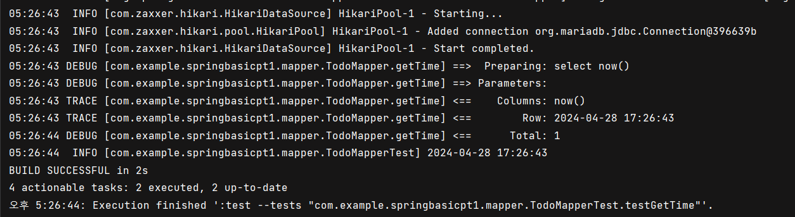
</p>
