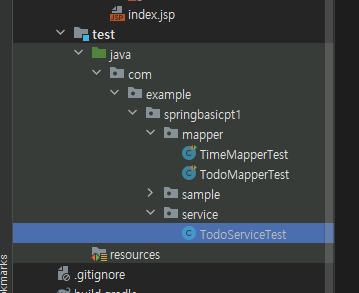

## 4. Todo 기능 개발

`등록 작업을 처리`

등록 작업의 경우 TodoMapper -> TodoService -> TodoController -> JSP의 순서로 처리.

### 1. TodoMapper 개발 및 테스트

1. insert() 기능 추가

TodoMapper에는 TodoVO를 파라미터로 받는 insert()를 추가.

TodoMapper.java
```java
package com.example.springbasicpt1.mapper;

import com.example.springbasicpt1.domain.TodoVO;

public interface TodoMapper {
    String getTime();

    void insert(TodoVO todoVO);
}
```

mappers 폴더에 만들어둔 TodoMapper.xml에 insert를 다음과 같이 구현.

```xml
<?xml version="1.0" encoding="UTF-8" ?>
<!DOCTYPE mapper
        PUBLIC "-//mybatis.org//DTD Mapper 3.0//EN"
        "http://mybatis.org/dtd/mybatis-3-mapper.dtd">
<mapper namespace="com.example.springbasicpt1.mapper.TodoMapper">
    <!-- MyBatis 매핑 파일로, 데이터베이스 작업을 위한 SQL 쿼리와 이를 실행할 메서드를 정의 -->
    <select id="getTime" resultType="string">
        <!-- id는 메소드 이름과 매핑, 실행 결과는 string 타입 -->
        select now() <!-- 현재 시각을 반환하는 SQL 쿼리 -->
    </select>

    <insert id="insert">
        insert into tbl_todo (title, douDate, writer)
        values (#{title}, #{dueDate}, #{writer} )
    </insert>
</mapper>
```
Mybatis를 이용하면 "?" 대신에 "#{title}" 같이 파라미터를 처리,

"#{title}" 부분은 PreparedStatement로 변경되면서 "?"로 처리되고, 주어진 객체의 getTitle()을 호출한 결과를 적용.


테스트 코드를 이용해서 TodoVO의 입력을 확인.


TodoMapperTest.java
```java
package com.example.springbasicpt1.mapper;

import com.example.springbasicpt1.domain.TodoVO;
import lombok.extern.log4j.Log4j2;
import org.junit.jupiter.api.Test;
import org.junit.jupiter.api.extension.ExtendWith;
import org.springframework.beans.factory.annotation.Autowired;
import org.springframework.test.context.ContextConfiguration;
import org.springframework.test.context.junit.jupiter.SpringExtension;

import java.time.LocalDate;

import static org.junit.jupiter.api.Assertions.*;

@Log4j2
@ExtendWith(SpringExtension.class)
@ContextConfiguration(locations = "file:src/main/webapp/WEB-INF/root-context.xml")
class TodoMapperTest {

    @Autowired(required = false)
    private TodoMapper todoMapper;

    @Test
    public void testGetTime() {
        log.info(todoMapper.getTime());
    }

    @Test
    public void testInsert() {
        TodoVO todoVO = TodoVO.builder() // 빌더를 이용해서 TOdoVO 객체를 생성
                .title("스프링 테스트")
                .dueDate(LocalDate.of(2022, 10, 10))
                .writer("user00")
                .build();
        todoMapper.insert(todoVO);
    }
}
```

테스트 실행 후에 tbl_todo 테이블을 조회해서 insert가 완료되었는지 확인.

<p align="center">
  
</p>


<p align="center">
  
</p>

### 2. TodoService와 TodoServiceImpl 클래스

TodoMapper와 TodoController 사이에는 서비스 계층을 설계해서 적용.

TodoService 인터페이스를 먼저 추가하고, 이를 구현한 TodoServiceImpl을 스프링 빈으로 처리.

<p align="center">
  
</p>

```java
package com.example.springbasicpt1.service;

import com.example.springbasicpt1.dto.TodoDTO;

public interface TodoService {
    void register(TodoDTO todoDTO);
}
```

TodoService 인터페이스에 추가한 register()는 여러 개의 파라미터 대신에 TodoDTO로 묶어서 전달 받도록 구성.

TodoService 인터페이스를 구현하는 TodoServiceImpl에는
의존성 주입을 이용해서 데이터베이스 처리를 하는 TodoMapper와 DTO, VO의 변환을 처리하는 ModelMapper를 주입.

```java
package com.example.springbasicpt1.service;

import com.example.springbasicpt1.domain.TodoVO;
import com.example.springbasicpt1.dto.TodoDTO;
import com.example.springbasicpt1.mapper.TodoMapper;
import lombok.RequiredArgsConstructor;
import lombok.extern.log4j.Log4j2;
import org.modelmapper.ModelMapper;
import org.springframework.stereotype.Service;

@Service
@Log4j2
@RequiredArgsConstructor
public class TodoServiceImpl implements TodoService {
    private final TodoMapper todoMapper;
    private final ModelMapper modelMapper;

    @Override
    public void register(TodoDTO todoDTO) {
        log.info(todoDTO);
        TodoVO todoVO = modelMapper.map(todoDTO, TodoVO.class);
        log.info(todoVO);
        todoMapper.insert(todoVO); 
        
    }
}
```

TodoServiceImpl 은 의존성 주입이 사용되는 방식은 **의존성 주입이 필요한 객체의 타입을 final로 고정**하고
@RequiredArgsConstructor를 이용해서 생성자를 생성하는 방식을 사용.

register() 에서는 주입된 ModelMapper를 이용해서 TodoDTO를 TodoVO로 변환하고 이를 TodoMapper를 통해서 insert 처리.
service 패키지는 root-context.xml에서 component-scan 패키지로 추가

<p align="center">
  
</p>


### 3. TodoService 테스트

<p align="center">
  
</p>


서비스 계층에서 DTO를 VO로 변환하는 작업을 처리하기 때문에 가능하면 테스트를 진행해서 문제가 없는지 확인하는 것이 좋음.
test 폴더내에 service 관련 패키지를 생성하고 TodoServiceTests 클래스를 작성.

```java
package com.example.springbasicpt1.service;

import com.example.springbasicpt1.dto.TodoDTO;
import lombok.extern.log4j.Log4j2;
import org.junit.jupiter.api.Test;
import org.junit.jupiter.api.extension.ExtendWith;
import org.springframework.beans.factory.annotation.Autowired;
import org.springframework.test.context.ContextConfiguration;
import org.springframework.test.context.junit.jupiter.SpringExtension;

import java.time.LocalDate;

import static org.junit.jupiter.api.Assertions.*;

@Log4j2
@ExtendWith(SpringExtension.class)
@ContextConfiguration(locations = "file:src/main/webapp/WEB-INF/root-context.xml")
class TodoServiceTest {

    @Autowired
    private TodoService todoService;

    @Test
    public void testRegister() {
        TodoDTO todoDTO = TodoDTO.builder()
                .title("Test...1")
                .dueDate(LocalDate.now())
                .writer("user001")
                .build();
        todoService.register(todoDTO);
    }

}
```
<p align="center">
  
</p>
<p align="center">
  
</p>
<p align="center">
  
</p>

---

### 4. TodoController의 GET / POST 처리

서비스 계층까지 문제 없이 동작하는 것을 확인했다면 스프링 MVC를 처리.

입력할 수 있는 화면을 위해 controller 패키지의 TodoController를 확인.

TodoController에 GET 방식으로 '/todo/register'가 가능한지 확인.

<p align="center">
  
</p>


<p align="center">
  
</p>


<p align="center">
  
</p>


/WEB-INF/view/todo/ 폴더에 register.jsp를 확인.

register.jsp는 test.html을 복사해서 구성.

상단에 JSP 관련 설정을 추가.

register.jsp에 class 속성이 "card-body"로 지정된 부분의 코드를 수정
입력하는 화면의 디자인은 https://getbootstrap.com/docs/5.1/forms/form-control/

<p align="center">
  
</p>


프로젝트를 실행하고 "/todo/register"를 호출하면 디자인 적용이 된 화면이 나오는지 확인.


1) POST 방식의 처리

register.jsp의 `<form method="post">` 태그에 의해서
submit 버튼을 클릭하면 POST 방식으로 "title, dueDate, writer"를 전송하게 됨.

TodoController에서는 TodoDTO로 바로 전달된 파라미터의 값들을 수집.

POST 방식으로 처리된 후에는 "/register/list"로 이동해야 하므로
"redirect:/todo/list"로 이동할 수 있도록 문자열을 반환


<p align="center">
  
</p>


<p align="center">
  
</p>


<p align="center">
  
</p>


한글 입력시

<p align="center">
  
</p>


정상적으로 데이터가 수집되기는 하지만 몇 가지 개선점이 있음
* 한글이 깨지는 문제
* 적당한 데이터를 전달하지 않았을 때 발생할 수 있는 문제

---


## 5. 한글 처리를 위한 필터 설정

<p align="center">
  
</p>
